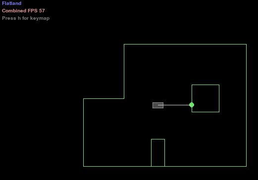
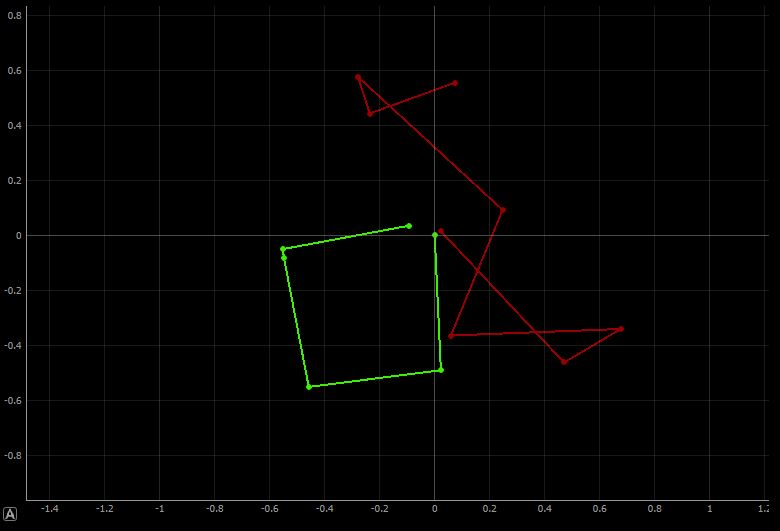

# Author: Swapnil Barot (NetID: spb228)
---

[Return to Main Page](https://spbarot.github.io/)

## I. Objective

The primary objective of this lab is to set up and utilize the robot simulation environment. The virtual robot shall controllably (open loop and closed loop) deploy in a square trajectory around the map with the help of live plotting tools.  This lab is a prelude to the next lab which focuses on the localization of the virtual robot using Bayes filter.

---

## II. Materials/Software

1. Jupyter Lab – Lab 10 Notebook

---

## III. Procedure/Design/Results

#### Simulator 

The similar integrated into the Jupyter Lab – Lab 10 notebook contains a wheeled robot equipped with a laser range finder to mimic a real robot’s ToF sensor. The changes in the robot’s position as recorded by the sensors are integrated over time to get a pose estimate of the robot – this is known as odometry. The virtual robot obtains simulated IMU (accelerometer, gyroscope, magnetometer) data to assist with the odometry pose estimate (turns of the virtual robot, etc). The similar contains ground truth data which is the exact position of the virtual robot within the simulator. 




---

#### Plotter 

The simulator is equipped with a plotter that can allow for live plotting of scatter plots using python. Ground truth, odometry, belief, map, and distributions can be plotted using this plotter. 

---

#### Controller

This lab revolves around programming the virtual controller in Jupyter Lab (python) to perform various functions on the virtual robot. The available Python API allows us to get the robot odometry pose, get senser data, and transpose the robot across the map. 

---

#### Open Loop Control Task

The virtual robot is first controller via an open loop control task that enables the robot to execute a square loop using set velocity commands (speed and angle). The ground truth and odometry of the robot can be found below. As seen in the software below, the duration of the velocity command is 1 second. This allows the robot to cover enough distance to perform the square movement. The robot always executes the same shape when the commands are run again. 

```
def left_turn():
    cmdr.set_vel(0, -1.5)
    #await asyncio.sleep(1)
    
def straight():
    cmdr.set_vel(0.5, 0)
    #await asyncio.sleep(1)
    
def stop():
    cmdr.set_vel(0,0)
    
def plot():
    pose, gt_pose = cmdr.get_pose()
    cmdr.plot_odom(pose[0], pose[1])
    cmdr.plot_gt(gt_pose[0], gt_pose[1])
    
if cmdr.sim_is_running() and cmdr.plotter_is_running():
    left_turn()
    await asyncio.sleep(1)
    stop()
    plot()
    
    straight()
    await asyncio.sleep(1)
    stop()
    plot()
    
    left_turn()
    await asyncio.sleep(1)
    stop()
    plot()
    
    straight()
    await asyncio.sleep(1)
    stop()
    plot()
    
    left_turn()
    await asyncio.sleep(1)
    stop()
    plot()
    
    straight()
    await asyncio.sleep(1)
    stop()
    plot()
    
    left_turn()
    await asyncio.sleep(1)
    stop()
    plot()
    
    straight()
    await asyncio.sleep(1)
    stop()
    plot()
```


The ground truth (green line/points) in the image above displays that the robot makes three turns while going forward in between to roughly complete a square. The robot does not turn exactly 90 degrees, making the square slightly skewed. If more time was available, the perfect turning time would have been found that would enable 90 degree turns. The odometry plot is inaccurate due to possible errors in measurements and inbuilt noise. 

<iframe width="560" height="315" src="https://www.youtube.com/embed/kZEEPyNVL2A" frameborder="0" allow="accelerometer; autoplay; encrypted-media; gyroscope; picture-in-picture" allowfullscreen></iframe>

---

#### Closed Loop Control Task 

The closed loop control task involves designing a controller to perform a closed – loop obstacle avoidance. The design scheme allows for the virtual robot to stop going forward when it senses the distance readings are < 0.3 m. When it does sense the readings are < 0.3 m, it turns the robot until the distance readings are > 1.0 m. 
<br>
The robot, to strictly avoid obstacles, should turn 90 degrees away from it so that it completely facing away. The robot approaches the wall at around 0.4 m/s which is deemed to be a decent speed for obstacle avoidance. When the speed is increased to more than 0.6 m/s with a distance limit of 0.3 m, the robot often overshoots and hits the walls. I believe 0.3 meters is how close the robot can get to a wall without colliding. The side of the robot however sometimes hits the boxes/walls as there is no sensor on the side. It would be a great idea to implement a sensor on the side of the robot so that obstacles can be avoided from all angles. 

```
while cmdr.sim_is_running() and cmdr.plotter_is_running():
    sensor_values = cmdr.get_sensor()
    if (sensor_values[0] < 0.75):
        cmdr.set_vel(0, (3.14/2))
    else:
        cmdr.set_vel(0.35, 0)
    print(sensor_values)
    plot()
    await asyncio.sleep(1)
```
<iframe width="560" height="315" src="https://www.youtube.com/embed/FDz6KO4s0wk" frameborder="0" allow="accelerometer; autoplay; encrypted-media; gyroscope; picture-in-picture" allowfullscreen></iframe>

---


## IV. Conclusion

The objective of this lab, to implement open loop and closed loop control in the simulator, is successfully satisfied. Overall, this lab was very fun to design and there were not any major issues faced in this lab as the guideline and the notebook were very clear. The knowledge gained in this lab regarding the simulation environment will highly assist in Lab 11. 

---

## V. References

1. [ECE 5960 – Lab 10 Guideline](https://cei-lab.github.io/ECE4960-2022/Lab10.html)

---

[Return to Main Page](https://spbarot.github.io/)


