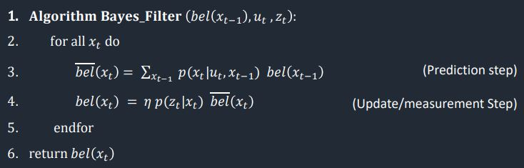
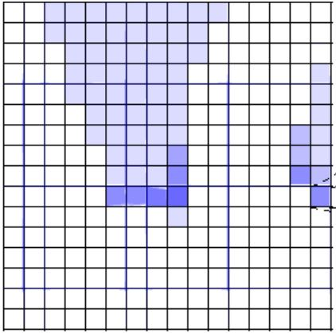
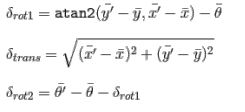
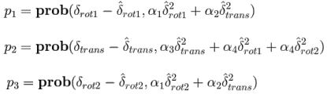
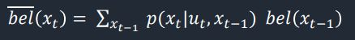
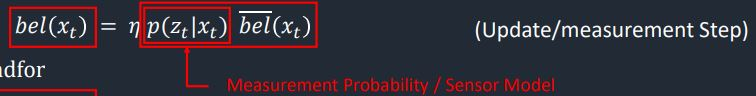
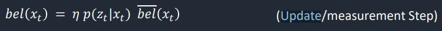
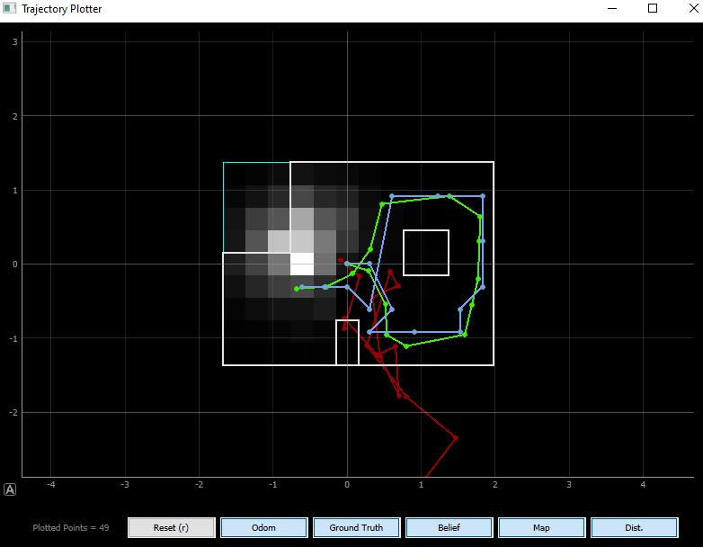

# Author: Swapnil Barot (NetID: spb228)
---

[Return to Main Page](https://spbarot.github.io/)

## I. Objective

The primary objective of this lab is to implement simulation based grid localization using Bayes Filter. The virtual robot shall determine its positioning on the map with respect to its environment utilizing Bayes filter algorithm. 

---

## II. Materials/Software

1. Jupyter Lab - Lab 11 Notebook


---

## III. Procedure/Design/Results

---

#### Bayes Filter Overview
Bayes filter is a general algorithm utilized for estimating the state of dynamic systems (robots) and to compute belief from observations and control data. For this lab, the Bayes filter is specifically used to obtain a belief of the robot’s previous and current state (grid tile position) based on the information received from the sensor and control inputs. To compute belief, the alrogrithm requires an intialy belief at t=0. In our case, the initial probability at the grid cell index (10,10,9) is 1.0 and every other cell has a value of 0. 



---

#### Grid Localization 
The robot state is 3 dimensional and is given by (x, y, θ). The robot’s world is a continuous space that spans from: 
* [-1.6764, +1.9812) meters or [-5.5, 6.5) feet in the x direction
* [-1.3716, +1.3716) meters or [-4.5, +4.5) feet in the y direction
* [-180, +180) degrees along the theta axis

The continuous real space is discretized into a finite 3D grid space consisting of three axes: x, y, and θ. Discretizing allows for the computation of belief over a finite set of states. The real grid cells are: 0.3048 m  x 0.3048 m x 20 degrees (18 cells). The total number of cells along the axis are (12,9,18) and each cell holds a probability of the robot’s presence at that cell. Thus, the belief of the robot is represented by the set of probabilities  of each grid cell, summing to 1. Therefore, the cell with the highest probability after each iteration of the Bayes filter is the most probable position of the robot and the probable cells across  different time steps forms the robot’s trajectory. 



---

#### Compute Control Function 

The compute control function contains the logic to determine the delta_rot1, delta_rot2, and delta_translation. This function calculates the control sequence of the robot between two given positions. 



```
def compute_control(cur_pose, prev_pose):
	# calculating translation
	delta_x = cur_pose[0] - prev_pose[0]  #x direction
	delta_y = cur_pose[1] - prev_pose[1]  #y direction
	delta_trans =  math.sqrt(delta_x**2 + delta_y**2)  #differenc in straight line distance

	delta_rot_1 = loc.mapper.normalize_angle((math.atan2(delta_y,delta_x)*180/np.pi) - cur_pose[2])
	delta_rot_2 = loc.mapper.normalize_angle(cur_pose[2] - prev_pose[2] - delta_rot_1)
	
	return delta_rot_1, delta_trans, delta_rot_2
```

---

#### Odometry Motion Model
The odometry motion model function retains the control information from the compute_control function and calculates the transition probability/action model for the prediction step. A Gaussian model is used to model is used to characterize the probability curve. 



```
def odom_motion_model(cur_pose, prev_pose, u):
	#receive controls from the previous and current pose
	odom_motion = compute_control(cur_pose,prev_pose)
	
	#calcualte the difference between the calculated and actual controls
	x1 = u[0] - odom_motion[0]   #rot1 error
	x2 = u[1] - odom_motion[1]   #trans error
	x3 = u[2] - odom_motion[2]   #rot2 error

	rot1_prob = loc.gaussian(x1,0,loc.odom_rot_sigma)      
	trans_prob = loc.gaussian(x2,0,loc.odom_trans_sigma)
	rot2_prob = loc.gaussian(x3,0,loc.odom_rot_sigma)

	prob = rot1_prob*trans_prob*rot2_prob
	return prob
```

---

#### Prediction Step

The prediction step is responsible for iterating through all the possible locations the robot may have been in, and calculating a belief that a given action might have led to the current location of the robot. There are six for loops implemented in the prediction step: previous x, y, θ and current x, y, and θ. 



```
def prediction_step(cur_odom, prev_odom):

	u = compute_control(cur_odom, prev_odom)                                                      #compute controls from the final and previous pose
	for prev_x in range(mapper.MAX_CELLS_X):                                                      #iterate through x 
		for prev_y in range(mapper.MAX_CELLS_Y):                                                  #iterate through y 
			for prev_theta in range(mapper.MAX_CELLS_A):                                          #iterate through theta 
				if (loc.bel[prev_x][prev_y][prev_theta]>0.0001):
					for cur_x in range(mapper.MAX_CELLS_X):                                       #iterate through new x 
						for cur_y in range(mapper.MAX_CELLS_Y):                                   #iterate through new y 
							for cur_theta in range(mapper.MAX_CELLS_A):                           #iterate through new theta 
								curr_pose = mapper.from_map(cur_x,cur_y,cur_theta)                #getting the current pose
								prev_pose = mapper.from_map(prev_x,prev_y,prev_theta)             #getting the previous pose
								#use the given grid pose make prediction for each grid
								loc.bel_bar[cur_x][cur_y][cur_theta] += odom_motion_model(curr_pose,prev_pose, u) * loc.bel[prev_x][prev_y][prev_theta]
	loc.bel_bar = loc.bel_bar/np.sum(loc.bel_bar)
```

---

#### Sensor Model

The sensor model is responsible for computing the probable correctness of the actual sensor reading based on the robot’s current position. A gaussian function is utilized to characterize the probability of the sensor readings. 



```
def sensor_model(zt,xt):

	#initialize prob_array
	(a,b,c) = xt
	prob_array = np.zeros(mapper.OBS_PER_CELL)
	for i in range(mapper.OBS_PER_CELL):      
		prob_array[i] = loc.gaussian(zt[i],loc.mapper.get_views(a,b,c)[i],loc.sensor_sigma) 

	return prob_array
```

---

#### Update Step

The update step performs an iteration through the grid and generates the probability that the observations match the cell from which they are obtained. The intermediate belief for every possible pose is multiplied by the probability of the sensor reading’s accuracy at that given pose. Based on this information, the belief is updated.  



```
def update_step():

	for x in range(mapper.MAX_CELLS_X):                                      
		for y in range(mapper.MAX_CELLS_Y):                            
			for a in range(mapper.MAX_CELLS_A):  
				loc.bel[x][y][a] = np.prod(sensor_model(loc.obs_range_data,(x,y,a)))*loc.bel_bar[x][y][a]
											
	loc.bel = loc.bel / np.sum(loc.bel)
```

---

#### Results

The virtual robot is ran on a pre-set trajectory while incorporating the Bayes filter algorithm including an observation cycle, prediction cycle, and an update step in between points. The ground truth is highlighted in yellow, odometry data in red, and belief in blue. It is evident that the belief is closely representative of the ground truth, signaling that the Bayes filter is quite accurate. The shaded tiles represent the probability (more white = more probable) of the robot’s next position based on the accumulated data. 



<iframe width="560" height="315" src="https://www.youtube.com/embed/U60MiTOEvIw" frameborder="0" allow="accelerometer; autoplay; encrypted-media; gyroscope; picture-in-picture" allowfullscreen></iframe>

---

## IV. Conclusion

The objective of this lab, to implement grid localization using Bayes filter, is successfully satisfied. Several issues regarding the understanding and the implementing of the algorithm in Python were faced during the lab. However, the staff did a great job of explaining the concepts and assisting in debugging errors. This was a very challenging lab, but it provided great knowledge on implementing Bayes filters for robotics. 

---

## V. References

1. [ECE 5960 – Lab 11 Guideline](https://cei-lab.github.io/ECE4960-2022/Lab11.html)
2. [ECE 5960 – Lecture 17](https://cei-lab.github.io/ECE4960-2022/lectures/FastRobots-17-Markov_BayesFilter1.pdf)
3. [ECE 5960 – Lecture 18](https://cei-lab.github.io/ECE4960-2022/lectures/FastRobots-18-BayesFilter1_Motion_models.pdf)
4. [CMU – Bayes Filtering]( https://www.cs.cmu.edu/~16831 f14/notes/F14/16831_lecture02_prayana_tdecker_humphreh.pdf)

---

[Return to Main Page](https://spbarot.github.io/)


