# Author: Swapnil Barot (NetID: spb228)
---

[Return to Main Page](https://spbarot.github.io/)

## I. Objective

The primary objective of this lab is to perform localization on the real robot, using only the update step of the Bayes Filter. Localization is the process of determining where a robot is located with respect to its environment. 

---

## II. Materials/Software

1. Fully Assembled Robot (Artemis, ToF Sensors, IMU, Motor Drivers)
2. Jupyter Lab

---

## III. Procedure/Design/Results

#### Setup

Lab 11 Bayes filter implementation and the provided optimized Bayes filter implementation are utilized to perform localization on the virtual robot. Once the localization on the virtual robot is successful, the real robot undergoes localization.  For this lab, the robot is placed in the following 4 marked positions on the map to attain sensor readings:
 
* (-3 ft ,-2 ft ,0 deg)
* (0 ft ,3 ft ,0 deg)
* (5 ft ,-3 ft ,0 deg)
* (5 ft ,3 ft ,0 deg)
 

At the abovementioned locations, the Tof sensors shall take 18 sensor readings at 20 degree increments starting from 0 degrees to 340 degrees (0, 20, 40, …, 340). These readings shall be passed into the RealRobot class module in Python where the 18 sensor readings are stored and utilized in the update step to determine the robot’s belief level and current position. 

---

#### Task 1 – Test Localization in Simulation

The provided localization implementation is first tested to confirm capability, before proceeding to the real robot. As seen in the plot below, the ground truth (blue), and the robot belief (green) are very similar indicating that the software demonstrates accurate implementation.   

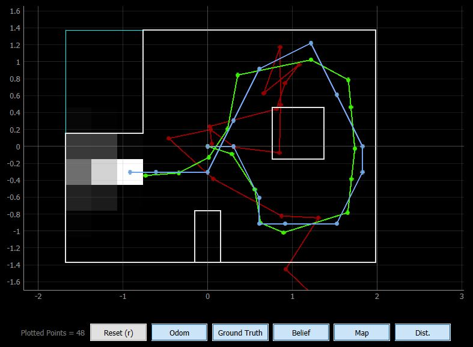

---

#### Task 2 – Update Step on Real Robot 

Task 2 involves running the update step using the ToF sensor readings to localize the robot on the map. This involves implementing PID control with the gyroscope so that 18 sensor readings at 20 degree increments starting from 0 degrees to 340 degrees (0, 20, 40, …, 340). This was implemented by enabling the robot to turn slowly and smoothly for 360 degrees and taking sensor readings at 20 degree increments. To capture distance readings every 20 degrees, the gyroscope values needed to be integrated. This was done by adding the multiplying the current_rotation (radians/second) by current_time – previous_time, and summating all the current_rotation values.  These sensor values and the associated rotation values are then stored in an array and passed into the RealRobot class module in Python so that the robot’s belief location can be determined. The image below displays the code used for turning the robot (PID) to gain readings. One of the adjustments we had to make was programming the robot to stop if the current angle is between 350 degrees and 370 degrees. This was done to ensure that the robot will stop even if it does not calculate an exactly 360 degrees turn. 

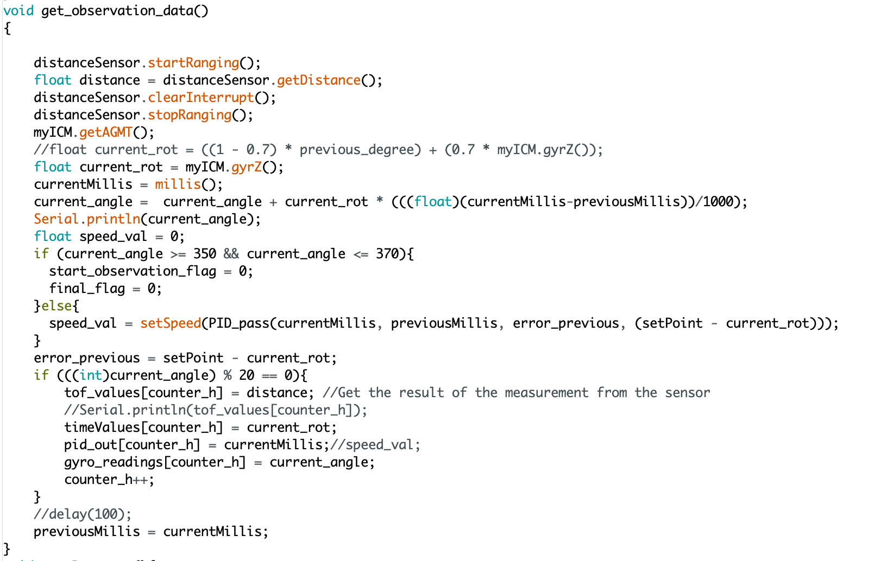

 

<iframe width="560" height="315" src="https://www.youtube.com/embed/uWDAeCTHezg" frameborder="0" allow="accelerometer; autoplay; encrypted-media; gyroscope; picture-in-picture" allowfullscreen></iframe>

 

Once the robot is able to capture and transmit readings adequately, the Lab 12 (Real) Jupyter Lab framework is setup to receive the readings, parse the data (ToF values, angle values), and feed the ToF readings to the perform_observation_loop function. As seen in the image below, there was a need to process and omit some reoccurring data. This was so as the robot would send multiple ToF readings for each 20 degrees increment. The processing omits multiple sensor readings at the same degree increment. Once the data is processed, it is send to the perform_observation_loop function as a np array. The program calculated the new belief position and probability for the four points on the map which is displayed in the images below.

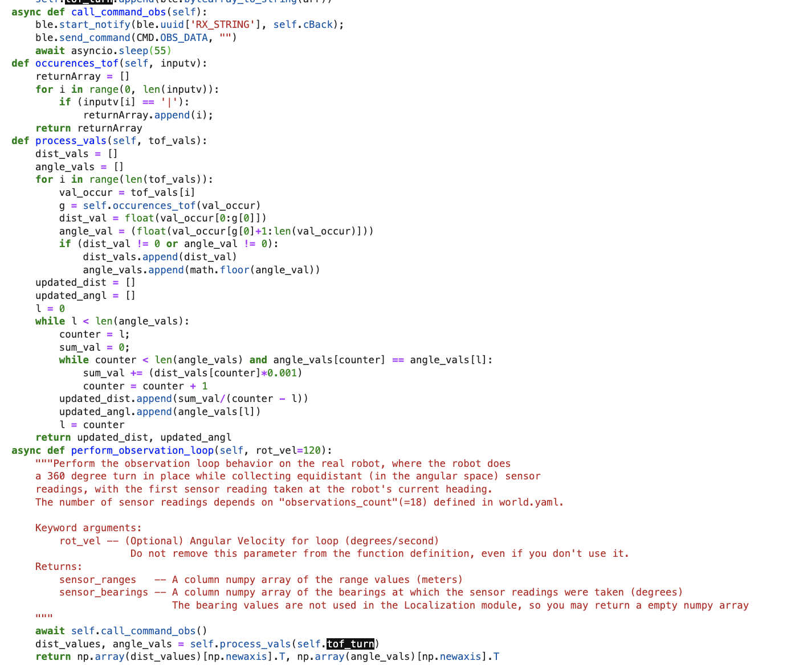

---

(0,3)

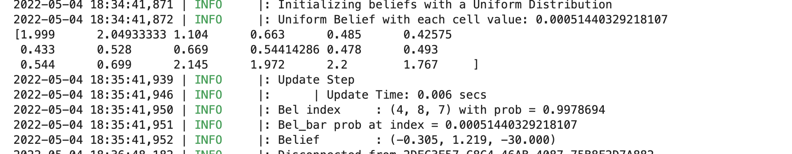
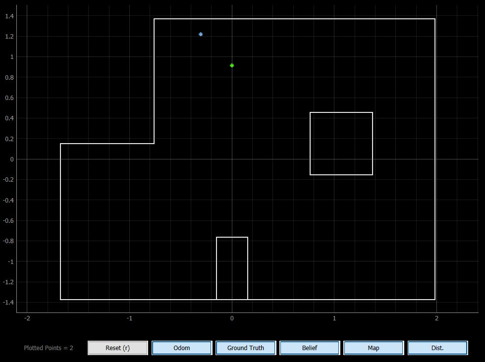

For this position, the robot belief happens to be at (-1,4) with a probability of 0.99. The reason for this may have been the inaccuracy of the ToF sensors which captured wrong readings, allowing the robot to believe it is in fact in a different position. Another reason for this inaccuracy could have been the fact that the robot gyroscope integration may not have been fully precise, causing the readings at the 20 degree intervals to be off. One way to combat this issue would have been to stop the robot at each 20 degree increment and then take the sensor readings, instead of constantly rotating the robot. It is also odd that the probability is 0.99 but the TAs mentioned that most beliefs, even if incorrect, happen to be 0.99. 

---

#### Results 

(-3,-2)

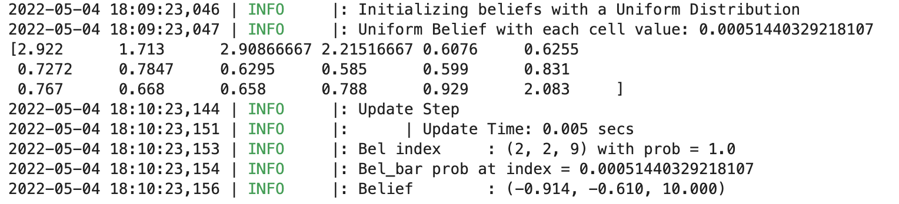
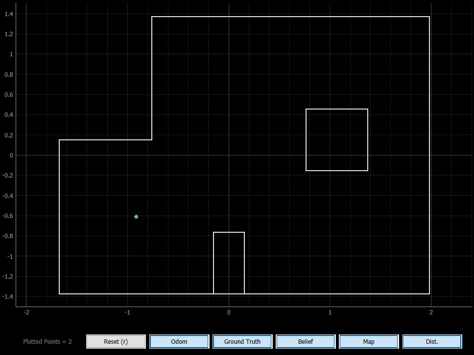

For this position, the robot belief happens to be accurate, with a probability of 1.00. 

---

(5,3)

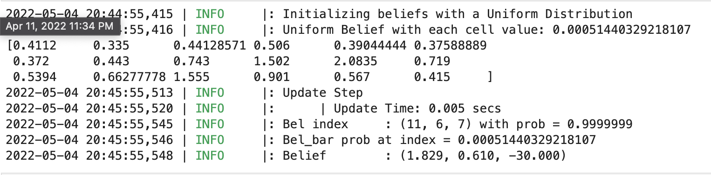
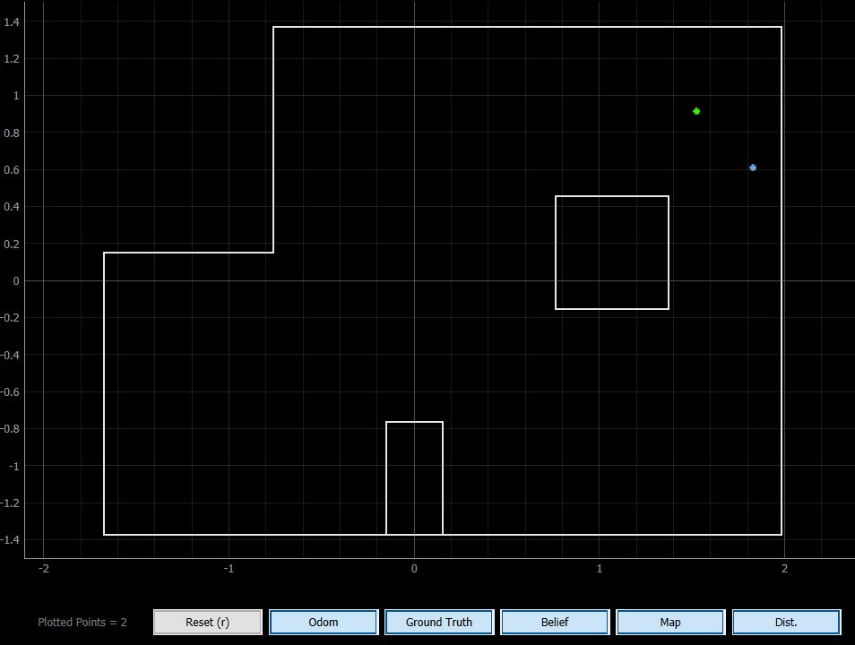

For this position, the robot belief happens to be (6,2), making it inaccurate, with a probability of 0.99. 

---

(5,-3)

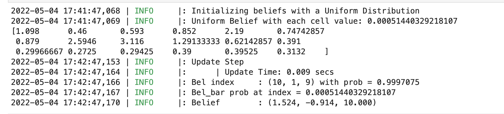
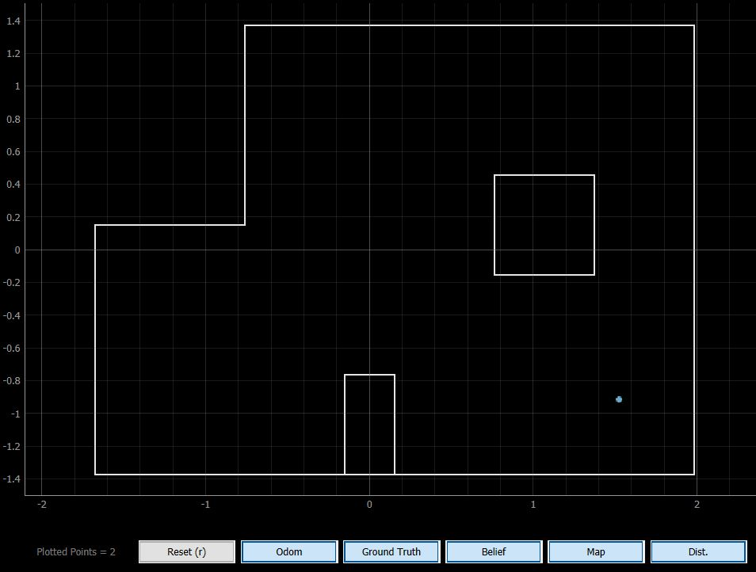

For this position, the robot belief happens to be accurate, with a probability of 0.99. 

---

Localization Summary 

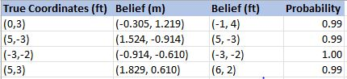

---

## IV. Conclusion

The objective of this lab, to perform localization using the update step of the Bayes filter on the real robot, is successfully satisfied. Overall, this lab was fun to design and but there were some minor problems faced during the experiments. It was extremely difficult to make the robot turn 360 degrees in one position again and it took a lot of trials before a good turn was obtained. To get better rotations, we frequently cleaned the robot wheels so there is better friction between the wheels and the floor. The lab guideline and the notebook were very clear and assisted a lot in programming the Bayes filter. The knowledge gained in this lab regarding the simulation environment will highly assist in Lab 13. 

---

## V. References

1. [ECE 5960 – Lab 12 Guideline](https://cei-lab.github.io/ECE4960-2022/Lab11.html)

#### Collaborators
Pillai, Nikhil

---

[Return to Main Page](https://spbarot.github.io/)

