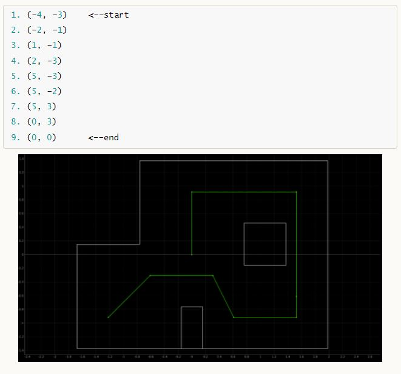
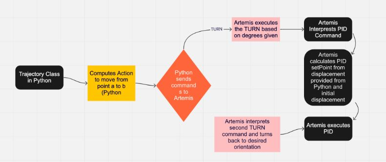
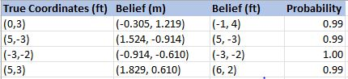
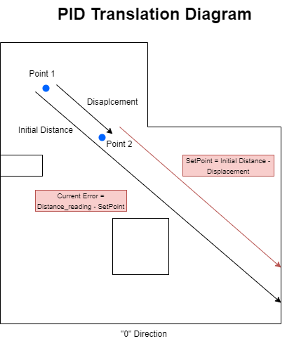
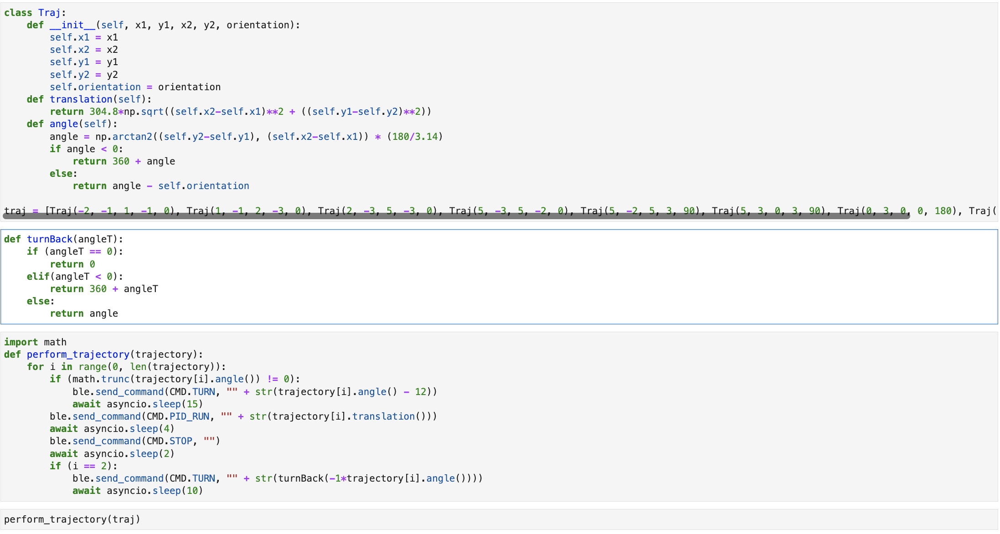

# Author: Swapnil Barot (NetID: spb228)
---

[Return to Main Page](https://spbarot.github.io/)

## I. Objective

The primary objective of this lab is to enable the robot to navigate through a set of waypoints shown below. The lab is designed to be very open ended allowing experimenters to use several concepts discussed and implemented in the course such as open loop, closed loop, PID, mapping, localization, and off-board commands. 



---

## II. Materials/Software

1. Fully Assembled Robot (Artemis, ToF Sensors, IMU, Motor Drivers)
2. Jupyter Lab

---

## III. Procedure/Design/Results

#### Overview
To enable the robot to effectively navigate through the set of waypoints shown above, we used closed loop feedback control (PID) for translations, closed loop feedback control (PID) for rotations, and offboard commands from Jupyter Lab. Below is the algorithm the robot follows to navigate through the map: 
* Start at a point facing the 0 direction
* Get an automized command from Jupyter Lab (for loop) to move towards next point
* Use closed loop feedback control (PID) for rotation and rotate towards the next point
* Use closed loop feedback control (PID) for translation and move towards the next point
* Use closed loop feedback control (PID) for rotation and rotate towards the 0 direction
* Get an automized command from Jupyter Lab (for loop) to move towards next point

Below is a diagram that showcases how the Arduino and Jupyter communicate to enable to robot to move through the map. 


---

#### Implementation Selection

There are several possible ways of going about this lab. One can perform open loop control with timed commands, incorporate PID for turning and translations, or use localization at waypoints to determine your current and future locations. We felt that incorporating PID for turns and translations would be the best approach for this lab as our Lab 12 localization results were poor. The image below shows our results from Lab 12. It can be seen that the localization results at (0, 3) and (5,3) are quite inaccurate. We also tried to localize at a few other points for Lab 13 but the results still turned out to be inaccurate. Thus, we decided to navigate through the map using PID. 



---

#### PID Translation Design

PID is implemented for this lab to perform translations and rotations.  The control scheme operates by providing the required output to a meet a specified setpoint. The controller outputs the PWM duty cycle that is used to drive the motors. Upon trial and error, it was noticed that the controller is the most effective when the KP value is 0.15, and the KD value is 3.0. To perform the translations, the Artemis gets a ping from Jupyter. When the ping is received, the distance sensor takes an initial reading. This initial reading is used to calculate the setpoint at that location (SetPoint = initial distance - displacement). The displacement is the distance between the two points the robot shall travel. Below is a diagram of the PID translation design and the associated software. 



<br>

One of the issues the team faced was getting a good distance measurement on the first point (-4, -3). The ToF readings from the first point were very inaccurate due to the long distance to the point across the map and the slanted angle. Because the inaccurate readings, the robot would calculate an inaccurate setpoint, causing the translation to fail. To encounter this issue, we decided to start the trajectory from the second point (-2, -1) and we ended the trajectory on the first point (-4, -3).


```
void pid_start()
{
    distanceSensor.startRanging();
    float distance = distanceSensor.getDistance();
    distanceSensor.clearInterrupt();
    distanceSensor.stopRanging();
    currentMillis = millis();
    timerCountCurrent = millis();
    float speed_val = setSpeed_val(PID_pass(currentMillis, previousMillis, error_previous, (distance - setPoint)));
    error_previous = distance - setPoint;
    previousMillis = currentMillis;
}

float PID_pass(float currentTime, float previousTime, float previous_error, float current_error){
  return (P * current_error) + (I * I_sum) + (D * (current_error - previous_error) / (currentTime - previousTime));
}

float setSpeed(float speed_1){
  float internalSpeed = speed_1;
  if (speed_1 >= 0){
    if (speed_1 > 110){
     internalSpeed = 110;
    }
    analogWrite(A0, 0);
    analogWrite(A1, 1.05*internalSpeed);//right
    analogWrite(A2, 1.1* internalSpeed);//left
    analogWrite(A5, 0);
    return internalSpeed;
  }else{
    return 0;
  }
}

```

#### PID Turn Design

The turns performed under this lab were done with the help of a PID controller. As seen in the code snippet below, the setpoint value (35 degrees/second) is subtracted from the current rotation value (readings from the gyroscope), and the subtracted value is fed into the PID_pass (PID controller computation), which then determines the PWM of the motors to rotate the robot about its axis. The actual angle is calculated in the function below by integrating the rotations. The degree values are autonomously passed in via Jupyter for each waypoint. 

```
void turn_degrees(float deg){
  myICM.getAGMT();
  float current_rot = myICM.gyrZ();
  currentMillis = millis();
  float speed_val = 0;
  current_angle =  current_angle + current_rot * (((float)(currentMillis-previousMillis))/1000);
  if (current_angle >= deg - 2 && current_angle <= deg + 2){
      turn_flag = 0;
      current_angle = 0;
      setSpeed(0);
   }else{
    speed_val = setSpeed(PID_pass_T(currentMillis, previousMillis, error_previous_T, (setPoint - current_rot)));
   }
   error_previous_T = setPoint - current_rot;
   previousMillis = currentMillis;
}
```

---

#### BLE Design (Jupyter Lab)

Jupyter is used in this lab to provide pings to the Artemis with the translation and rotation information. To carry this out, we made a python class “Traj” that takes in 5 values (x1, x2, y1, y2, orientation) and calculates the translation between the two points using translation function and the angle between the two points using the angle function seen in the code snippet below. 

The turnback function in Jupyter orients the robot to the “0” direction so that the next rotation and translation can be performed. The perform_trajectory function cycles through all the waypoints defined in the class Traj one by one, and outputs the next turn angle or the next translation distance via BLE pings. We used asyncio sleep functions to give the robot enough time to rotate/turn before the next ping is sent to the Artemis. 



#### Issues Faced

There were several issues faced in this lab as this was the toughest lab of the course. The primary issue we faced was the BLE connection. After a certain time (~90 seconds) the BLE connection times out. Since our BLE signals the Artemis the next rotation and translation angles, this problem is monumental and causes the robot to crash. Since the entire trajectory took about 140 seconds to complete, the program would lose BLE connection and time out, causing the robot to crash. Therefore, we decided to split the trajectory into two runs filmed separately (Part 1 and Part 2). Upon consulting a TA, it was found that this is a known Mac issue. Below is a clip of what the BLE timeout error looks like. 

<iframe width="560" height="315" src="https://www.youtube.com/embed/NgyEgFVPRMw" frameborder="0" allow="accelerometer; autoplay; encrypted-media; gyroscope; picture-in-picture" allowfullscreen></iframe>


<br>

The other prominent issue we faced during this lab was the inaccuracy of the ToF sensor. Several times during a run, the ToF sensor would output wrong distance readings. This was discovered by tethering the robot and reading the distance values in the serial monitor. Due to this issue, the ToF readings from the first point were very inaccurate due to the long distance to the point across the map and the slanted angle. Because the inaccurate readings, the robot would calculate an inaccurate setpoint, causing the translation to fail. To combat this issue, we started on the second point and ended on the first point. Generally, it was a matter of getting lucky and hoping the distance sensor reads the correct values at each waypoint. 

Another major issue we faced was the pre-caching of the ToF sensor. The ToF sensor outputted the distance value that was taken from the previous compilation. Eventually, we found that this happened because the distance sensor data was not ready and therefore it kept outputting previous values. To ensure the data would be ready, we used the following code which checks if the data is ready. 

```
while (!distanceSensor.checkForDataReady() && cent.connected()){
      delay(1);    }
```

---


---

#### Results 

<iframe width="560" height="315" src="https://www.youtube.com/embed/GLX7j7TNE9s" frameborder="0" allow="accelerometer; autoplay; encrypted-media; gyroscope; picture-in-picture" allowfullscreen></iframe>

<br>

<iframe width="560" height="315" src="https://www.youtube.com/embed/jDliG3fiCXA" frameborder="0" allow="accelerometer; autoplay; encrypted-media; gyroscope; picture-in-picture" allowfullscreen></iframe>

<br>

<iframe width="560" height="315" src="https://www.youtube.com/embed/vB2Yq-hQNg4" frameborder="0" allow="accelerometer; autoplay; encrypted-media; gyroscope; picture-in-picture" allowfullscreen></iframe>


---


## IV. Conclusion

The objective of this lab, to navigate the robot through the waypoints, was successfully completed. This has been the most complex and time consuming lab in this course. We spent about 25-30 hours in the lab over a week trying to perfect the trajectory run. Even though we faced many issues, the lab was very rewarding as it summated a lot of important concepts learned throughout the course. As always, the Professor and the TAs were very helpful and helped debug several issues. 

---

## V. References

1. [ECE 5960 – Lab 13 Guideline](https://cei-lab.github.io/ECE4960-2022/Lab13.html)

#### Collaborators
Satheesh Pillai, Nikhil

---

[Return to Main Page](https://spbarot.github.io/)


