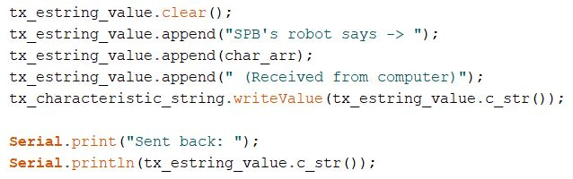
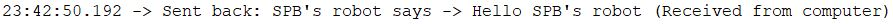
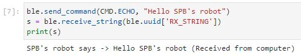
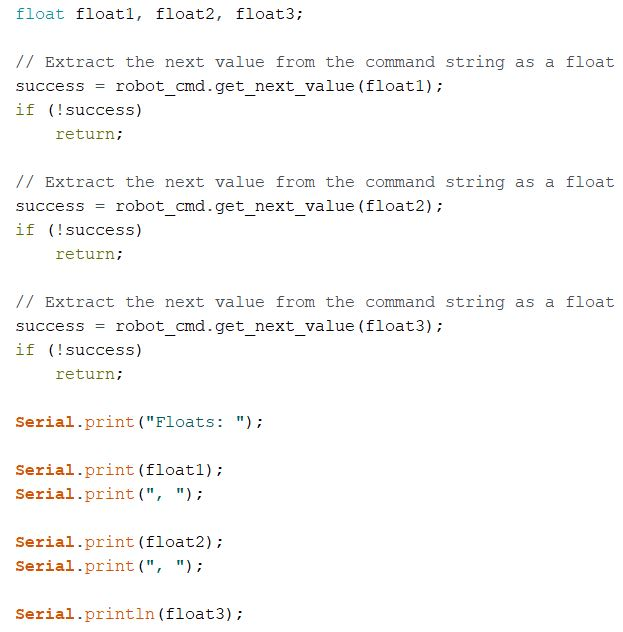
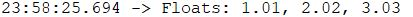
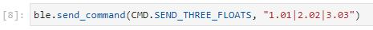
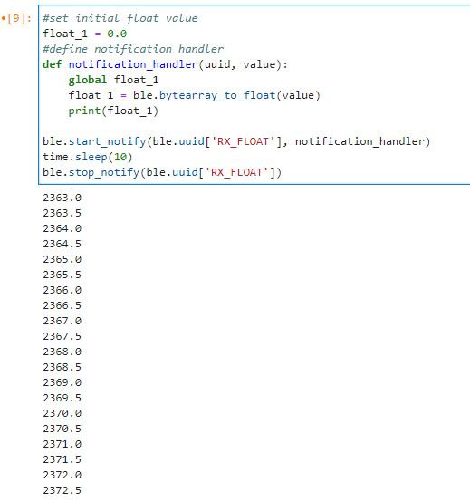
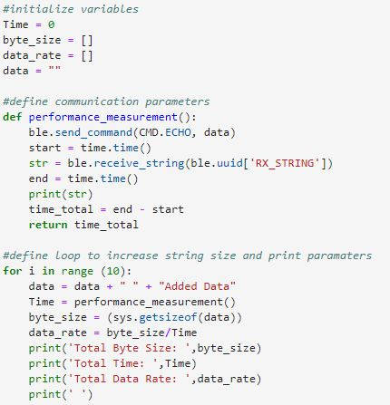
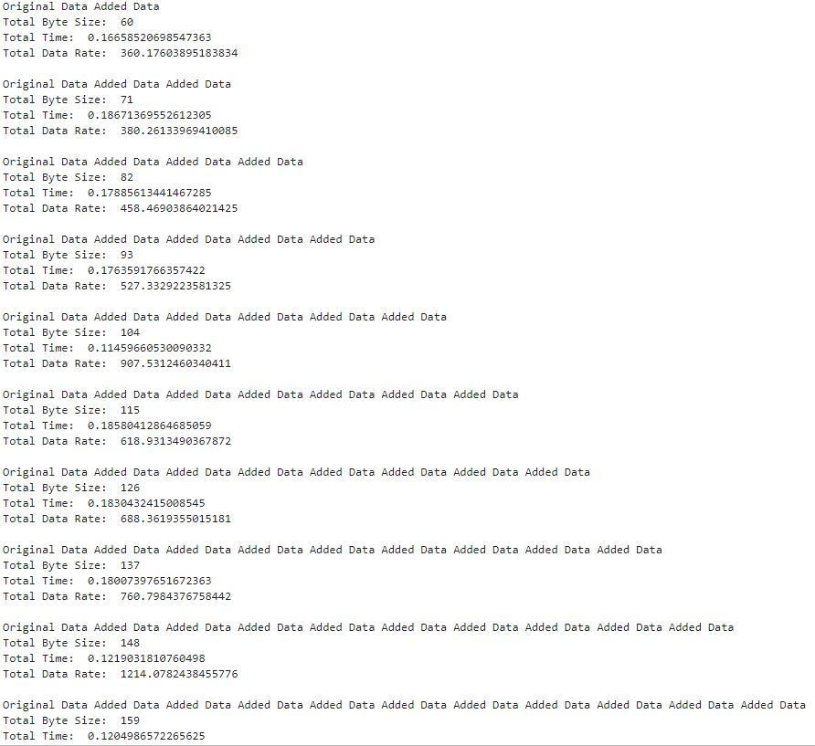
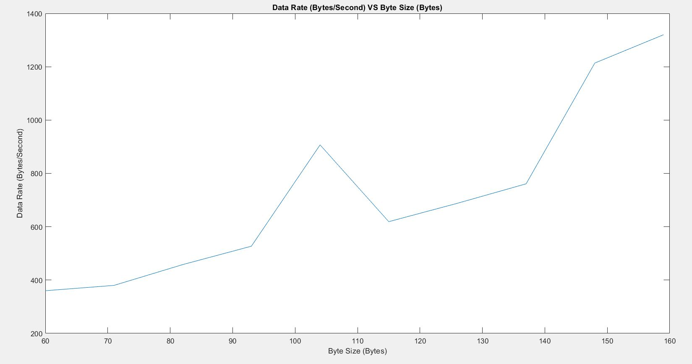

# Author: Swapnil Barot (NetID: spb228)
---

[Return to Main Page](https://spbarot.github.io/)

## I. Objective

The goal of this lab is to understand the Bluetooth implementation used to interconnect the computer (off-board computing) and the Artemis board (on-board computing), while configuring and establishing Bluetooth communication. Lab tasks involve installing and configuring a virtual environment, python, and Jupyter, configuring Bluetooth communication between the computer and the Artemis board, sending, and receiving string/float values, and creating a notification handler. 

---

## II. Materials/Software

1. 1x SparkFun RedBoard Artemis Nano
2. 1x USB A to C Cable
3. Computer
3. Arduino IDE (Software)
4. JupyterLab (Software)

---
## III. Procedure/Design/Results

#### System Setup

First download/upgrade Python 3 and pip. Then install a virtual environment. Install JupyterLab and follow the JuputerLab tutorial as required. Now, setup the Artemis board by installing ArduinoBLE from the library manager. Once all the software is installed, configure and match the MAC address and UUIDs of the Artemis board. 
    
---

#### Task 1 – Send an ECHO Command

The first task involves sending an “ECHO” command with a string value from the computer to the Artemis. The Artemis then receives the command and sends an augmented string back to the computer. As show in the images below, CMD.ECHO is utilized to send a string (Hello SPB’s Robot) to the robot (Artemis). The Artemis then sends the string back to the computer (SPB’s Robot Says -> Hello SPB’s Robot (Received From Robot)).   
 

---

#### Task 2 – Send Three Floats

Task 2 involves sending three float values to the Artemis board using the SEND_THREE_FLOATS command. “ble.send_command” is utilized to transmit three float values to the Artemis. The Artemis extracts the values using “robot_cmd.get_next_value”. The images below display the program and the serial output in detail.  

  

---

#### Task 3 – Notification Handler
 
A notification handler is setup to receive float values from the Artemis board. In the callback function, a float value is stored as a global variable such that it is updated every time the characteristic value changes. This eliminates the need to utilize the receive_float() function. 

---

#### Task 4 – BLEFloat VS BLEString

Receiving a float value in python using receive_float() / BLEFloatCharacteristic enables python to directly receive a float value as a byte array (as transmitted by Artemis). On the other hand, using receive_string() / BLECStringCharacteristic forces python to convert the characters to floats in a byte array. The first option (float) requires 4 bytes (per float) while the second option (string) requires 1 byte (per character). Thus, the float values are more memory expensive, however, can lead to more precision.  It shall be noted that both options produce similar results. 

---

#### ECE 5960 Additional Tasks - Task 1 – Effective Data Rate
This task involves sending a message from the computer to receive a reply from the Artemis, while calculating the times and the data rate of each of the events. To measure the data rate, “performance_measurement” function is utilized, which transmits and receives strings while keeping track of the time. The subsequent for-loop adds to the string in each iteration, increasing the byte size of the package. This information is then captured and computed to capture the data rate (bytes/second), as shown in the images below. 

---
#### ECE 5960 Additional Tasks - Task 2 – Reliability

The reliability of the data transfer is also tested. To test the reliability of the system, data was sent at a much higher rate from the robot (Artemis) to the computer. This was accomplished by shortening the Arduino interval time to 100 milliseconds (500 milliseconds is typical), and by increasing the baud rate to 1000000 from 115200. As shown in the image below, the output is very similar to the Effective Data Rate task output, signaling that the higher data rate has no significant effect on the reliability. 

---

## IV. Conclusion

The goals of this lab were successfully satisfied as the experimenters utilized Bluetooth framework to interconnect the computer and the Artemis board. Knowledge gained in this lab will assist in utilizing Bluetooth in the future labs. The experiment was quite smooth, and the given references/guideline seemed to be very helpful. 

---

## V. Code Appendix

Please refer to respective tasks in Section III - Procedure/Design/Results for the code. 

---

## VI. References

1. [ECE 5960 – Lab 2 Guideline](https://cei-lab.github.io/ECE4960-2022/Lab2.html)
2. [Jupyter Lab Tutorial](https://cei-lab.github.io/ECE4960-2022/tutorials/jupyter_notebooks.html)

---

[Return to Main Page](https://spbarot.github.io/)

