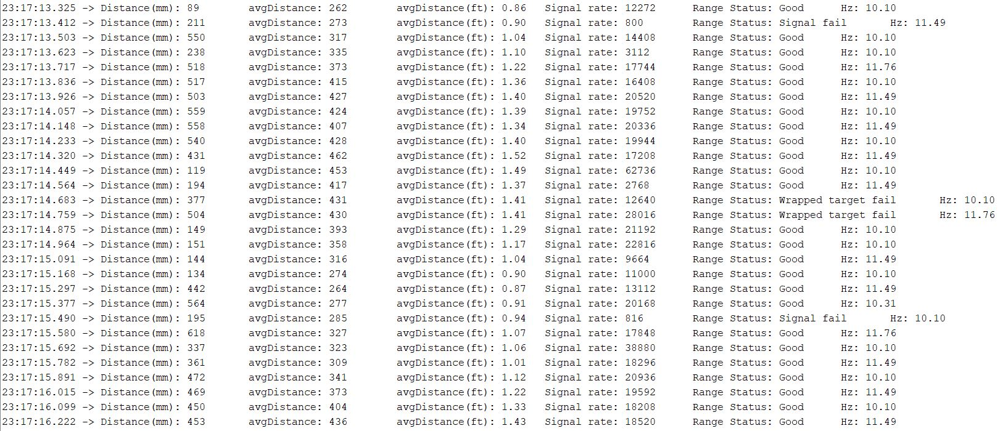

# Author: Swapnil Barot (NetID: spb228)
---

[Return to Main Page](https://spbarot.github.io/)

## I. Objective

The goal of this lab is to wire all the sensors, test the sensors, and equip the robot with the sensors. Sensor readings for the ToF and the IMU sensors are computed, tested, and analyzed. 

---

## II. Materials/Software

1. 1x SparkFun RedBoard Artemis Nano
2. 1x USB A to C Cable
3. 2x ToF Sensors
4. 1x IMU Sensor
5. 1x Quik Connector
6. Tape Measure
7. Arduino IDE (Software)
8. JupyterLab (Software)

---
## III. Procedure/Design/Results

#### System Setup

Wires are connected from the Artemis Board to the Two (2) TOF (Time of Flight) sensors and one (1) IMU (Inertial Measurement Unit) Sensor and soldered together to form permanent connections. 


    
---

#### Task 1 – Time of Flight Sensors (Example 5_Wire_I2C)

The first task of the lab is to verify the address of the first TOF sensor. This can be done by compiling the example code found at File -> Examples -> Apollo3 -> Example05_Wire_I2C. It shall be noted that the program only functions correctly when there is one (1) TOF interconnected with the Artemis Board. Because, I already had two (2) TOF sensors and one (1) IMU connected before beginning this example code, the output is not as expected.

As seen the image below, when multiple sensors are connected, the program outputs all the possible addresses (0x1, 0x2….0x7E). If only one TOF sensor was connected, the program would output the address of that sensor.  
 


---

#### Task 2 – Time of Flight Sensors (Short Distance Mode VS Medium Distance Mode VS Long Distance Mode)
The data sheet for VL53L1X provides information on the three modes (Short Distance, Medium Distance, and Long Distance) of the sensor. The short distance mode has a maximum sampling rate of 50 Hz and is mostly immune to ambient light, but the maximum ranging distance is limited to 1.3m (4.4ft). The medium distance has a maximum sampling rate of 30 Hz and has a maximum ranging distance of 3.0m (9.8ft). The long distance mode has a maximum sampling rate of 30 Hz with a maximum ranging distance of 4m (13.1ft). 
Out of the three modes, it is hypothesized that the long range mode will be the most effective for the robot. While the long range is highly susceptible to the environment, the robot will be functioning in a relatively controlled environment (indoor electronics laboratory). This will minimize most environmental factors influencing the sensors, while providing a (roughly) 4m sensing range which can assist in mapping the surroundings. Also, since the robot is extremely fast, it will need to sense walls quicker and from further distances, making the long distance mode more favorable. 

---

#### Task 3 – Time of Flight Sensors (Read Distance)

The TOF sensor is tested using the “ReadDistance” program found at File -> Examples -> SparkFun_VL53L1X_4m_Laser_Distance_Sensor\examples\Example1_ReadDistance. As seen in the image below, the sensor was taped to a laptop and the measured distance from a wall was obtained with both available modes (long distance mode and short distance mode). The graph below displays the measured data. While the short distance mode was more accurate, its maximum range was about 1450mm. The long distance mode was slightly less accurate but could sense up to much higher distances. Testing the sensor against different surfaces/colors also resulted in fairly accurate measurements. 


---    

#### Task 4 – Time of Flight Sensors (Enable Both TOF Sensors)

To enable both TOF sensors, I strategized to interconnect one TOF sensor’s shutdown pin to a GPIO in the Artemis. This will allow for the program to turn off one TOF sensor, change its address (to 0x30), and turn it back it back on. Below is the code that handles this scheme. 

```
digitalWrite(A2, LOW); //Turn TOF sensor off
distanceSensor.setI2CAddress(30); //Set the new I2C address
digitalWrite(A2, HIGH);//Turn TOF sensor on
```


---
#### Task 5 – Time of Flight Sensors Additional Tasks (Infrared Transmission)

The TOF sensors utilized in this lab use infrared light (lasers) to determine depth/distance information. The sensor emits a signal, which hits an object (wall) and returns to sensor. The time it takes for the signal to get back to the sensor is used to determine the distance of that object. The pros of a TOF sensor (IR based) are the package size (form factor), and low sensitivity to environment. The cons of such a sensor are cost and low sampling frequency. Amplitude based infrared sensor on the other hand measure the distance using the amplitude of the reflected signals, instead of the time. The pros of such a sensor are cost and package size (form factor). The con of these sensors is susceptibility to the environment. 
  
---

#### Task 6 – Time of Flight Sensors Additional Tasks (Timing Budget)

 Timing budget of a sensor is described as the programmed time needed by the sensor to perform and report measurement data. The TOF sensor data sheet states that the “setTimingBudget” function sets the timing to perform one range measurement. The “setInterMeasurementPeriod” function sets the delay between two ranging operations. Setting the timing budget to a low value will ensure a quicker reading. Setting the intermeasurement period to a low value will ensure less time between two readings. Since the robot is relatively fast, it would be advantageous to have faster readings so that the environment can be mapped quicker. Therefore, I plan on using a timing budget of 20ms, and a intermeasurement period of 60ms. 

```
  distanceSensor.setTimingBudgetInMs(60);
  distanceSensor.setIntermeasurementPeriod(20);
```
---

#### Task 7 – Time of Flight Sensors Additional Tasks (Signal and Sigma)

Signal and Sigma are two parameters the driver uses to qualify the ranging measurement. If signal or sigma are outside the typical limits, the ranging is flagged as invalid. As seen in the image below, the Range Status for certain measurements states “Signal Fail” or “Wrapped Target Fail”, indicating a bad sensor read due to exceeding Signal and Sigma limits. This feature can be useful in a fast robot, where the sensor is experiencing high velocities. Inaccurate readings can be effectively flagged and voided. 



---


#### Task 8  – Inertial Measurement Unit (Setup the IMU)
 
The program found at File -> Examples -> SparkFun_ICM-20948_ArduinoLibrary-master -> Examples -> Arduino -> Example1_Basics is ran and the output is displayed in the image below. The ADO_VAL value is the value of the last bit of the I2C address of the IMU. It is set to 1 by default. Since the ADR jumped is closed, the ADO_VAL should be set to 0. The IMU sensor outputs acceleration, angular velocities, and magnetic field intensities. It is noticed that when the IMU is laying flat on a surface, az is roughly equal to the Earth’s gravitational force. Ax, and Ay are roughly zero. Since the IMU is not moving the angular velocities (gyroscope readings) are also roughly zero. As the IMU is moved and rotated, the values shift instantaneously, as shown in the serial plotter image below. 


---

#### Task  9 – Inertial Measurement Unit (Accelerometer Pitch and Roll)

Yaw, pitch and roll are the angles of rotations around the X, Y, and Z axis which are used to calculate the tilt of the sensor. The equations from the class were utilized to calculate the pitch and the roll of the IMU. 

```
SERIAL_PORT.print("Roll [ ");
Serial.print((atan2(sensor->accY(),sensor->accZ()))*180/M_PI);
SERIAL_PORT.print(" ], Pitch [ ");
Serial.print((atan2(sensor->accX(),sensor->accZ()))*180/M_PI);
```


---

#### Task  10 – Inertial Measurement Unit (Accelerometer Frequency Response)

Tapping the sensor resulted in spontaneous spikes in the data that swiftly damped away. Using the Matlab FFT program, the frequency of the taps was displayed. Most of the spikes happened to be in the 3Hz to 10Hz domain. Creating a low pass filter for the system reduced the noise caused by tapping slightly. However, some noise still remained. 

---

#### Task  11 – Inertial Measurement Unit (Gyroscope Pitch, Roll, and Yaw)

The pitch, roll, and yaw of the gyroscope was calculated by using the equations discussed in the lectures. Since the gyroscope measures the angular velocities, integration of those values will provide the tilt angles. The output of the gyroscope had much less noise compared to the output of the accelerometer. It can also be noticed that the gyroscope readings tend to drift instead of stabilizing at a particular point. This can be caused due to the noise build up in the gyroscope. Lastly, the gyroscope also requires initial value to output sensor readings. 

```
  gyro_X_angle = gyro_X_angle - sensor->gyrX() * dt;
  gyro_Y_angle = gyro_Y_angle - sensor->gyrY() * dt;
  gyro_z_angle = gyro_z_angle - sensor->gyrZ() * dt;
  SERIAL_PORT.print("Gyro Roll:");
  printFormattedFloat(gyro_X_angle,3,2);
  SERIAL_PORT.print(",");
  SERIAL_PORT.print("Gyro Pitch:");
  printFormattedFloat(gyro_Y_angle,3,2);
  SERIAL_PORT.print(",");
  SERIAL_PORT.print("Gyro Yaw:");
  printFormattedFloat(gyro_Z_angle,3,2);
  SERIAL_PORT.println();
```


---

#### Task  12 – Inertial Measurement Unit (Gyroscope with Filter)

Using a complementary filter of 0.05 and combining the accelerometer and gyroscope readings, precise roll and pitch angles were computed as seen below. Sensor fusion and a filter in conjunction turn out to stabilize the sensor extremely well. 

```
  float accPitch = atan2(sensor->accX(), sensor->accZ())* 360 / (2 * M_PI);
  float accRoll = atan2(sensor->accY(), sensor->accZ()) * 360 / (2 * M_PI);
  float gyrPitch = sensor->gyrX();
  float gyrRoll = sensor->gyrY();
  
  if (first) {
    pitch = accPitch - gyrPitch * dt;
    roll = accRoll - gyrPitch * dt;
    first = false;
  } else {
    pitch = (pitch + gyrPitch * dt)*(1-PITCH_CONSTANT) + accPitch * PITCH_CONSTANT;
    roll = (roll + gyrRoll * dt)*(1-ROLL_CONSTANT) + accRoll * ROLL_CONSTANT;
  }
  SERIAL_PORT.print("IMU Pitch:");
  printFormattedFloat(pitch,3,2);
  SERIAL_PORT.print(", ");
  SERIAL_PORT.print("IMU Roll:");
  printFormattedFloat(roll,3,2);
  SERIAL_PORT.println();
}
``` 


---

#### Task  13 – Inertial Measurement Unit Additional Task (Magnetometer Yaw Angle)
The magnetometer Yaw angle was calculated using the equations provided in the lab guideline. It was noticed that the Yaw angle shifts as the IMU is rotated. The magnetometer reached the lowest values when it was pointing in the North Direction. The output of the magnetometer is also robust to small changes in pitch. 

```
xm = myICM.magX()*cos(pitch) - myICM.magY()*sin(roll)*sin(pitch) + myICM.magZ()*cos(roll)*sin(pitch); //these were saying theta=pitch and roll=phi 
ym = myICM.magY()*cos(roll) + myICM.magZ()*sin(roll_rad); 
yaw = atan2(ym, xm);
```

---

## IV. Conclusion

The objectives of this lab were successfully completed. All the sensors were wired, tested, and equipped on the robot. The sensor programs created in this lab will assist in the future labs to autonomize the robot and capture the surroundings. This lab took roughly two weeks to complete due to soldering, as well as the several tasks associated with the sensors. Overall, the lab went quite smooth and the lab guideline proved to be very helpful. 

---

## V. References

1. [ECE 5960 – Lab 3 Guideline]( https://cei-lab.github.io/ECE4960-2022/Lab3.html)
2. [IMU Software Library]( https://github.com/sparkfun/SparkFun_ICM-20948_ArduinoLibrary)
3. [ToF Sensor Manual]( https://cdn.sparkfun.com/assets/e/1/8/4/e/VL53L1X_API.pdf)
4. [Fast Fourier Transform Python]( https://www.alphabold.com/fourier-transform-in-python-vibration-analysis/)

---

[Return to Main Page](https://spbarot.github.io/)


