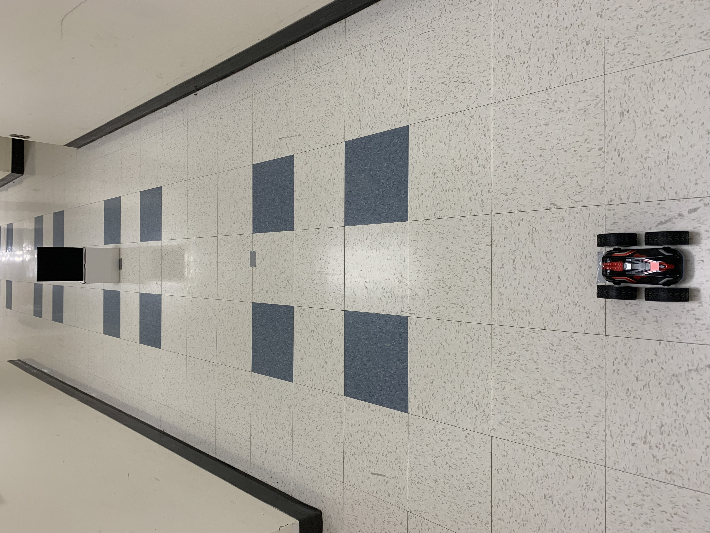
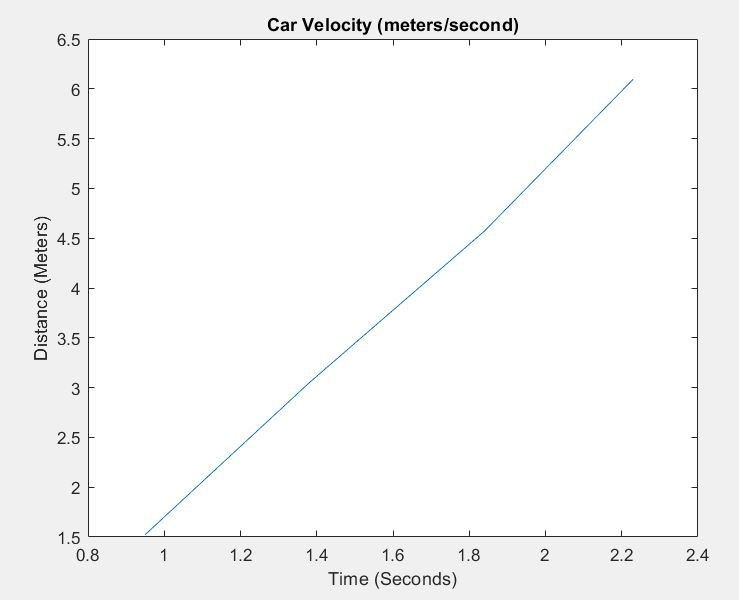
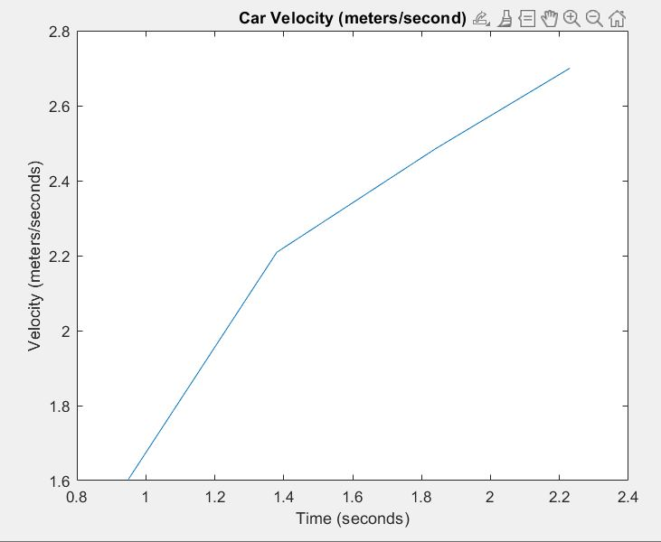
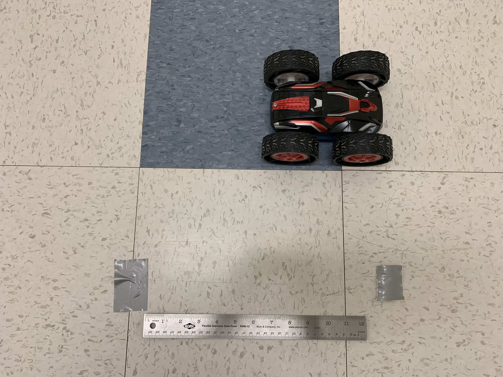
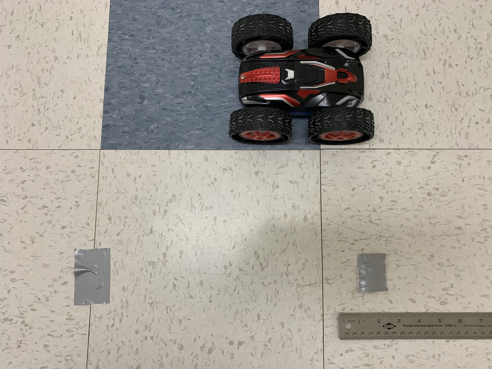

# Author: Swapnil Barot (NetID: spb228)
---

[Return to Main Page](https://spbarot.github.io/)

## I. Objective

The objective of this lab is to familiarize ourselves with the capabilities of the hardware in the robot. The goal is to methodically document the robot in a way that can be useful in the future labs. 

---

## II. Materials/Software

1. 1x SparkFun RedBoard Artemis Nano
2. 1x USB A to C Cable
3. Car and Remote Controller
4. Stopwatch
5. Tape

---

## III. Procedure/Design/Results

#### Task 1 – Car Dimensions
Below are the dimensions of the car:
* Car Length (with wheels) – 182 mm
* Car Width (with wheels) – 149 mm
* Car Height (with wheels) – 75 mm
* Wheel Diameter – 75 mm

The dimensions of the car are important to note as they will influence the distance/depth measurements. The offset from the sensor to the front of the car will be helpful when measuring the distance to an object. 

---

#### Task 2 – Car Weight

The car, when equipped with the 850 mAh battery and fully enclosed with cover plates, weighs roughly 530 grams. It will be interesting to note the weight of the car with our sensors, motor drivers, and wiring, as opposed to the factory’s default PCB and wiring. If the car gets significantly heavier with the new equipment, the car speed and the battery life may be negatively affected. 

---

#### Task 3 – Battery Lifetime

The battery life (850 mAh) of the vehicle was tested by constantly straining the car. This includes running the robot forward, backward, and sideways continuously. The robot functioned for about 8 minutes and 20 seconds until it came to a halt and became unresponsive. This information can be helpful while experimenting with the robot as you can understand exactly how much time you have until the battery needs to be recharged. 

---

#### Task 4 – Range of Speed

It is important to note the velocity of the robot for several reasons. First, the velocity of the robot can help dictate how fast we need to sample the distance measurement (ToF sensor) in order to effectively sense objects in the robot’s path. For example, if the robot has too much velocity, it may not be able to sense the distance fast enough for object avoidance. 
The speed of the robot was tested by checking how much time the car took to cover certain distances, with the help of a stopwatch. As seen in the image below, tape is placed on the floor to mark out 5 feet segments, totaling 20 feet. The velocity of the car is computed in the graph below based on how much time the car took to reach the four checkpoints (5, 10, 15, 20 ft).   This was done several times to achieve data average (mean). The average time it took for the car to surpass the checkpoints of (5, 10, 15, 20 ft) was (0.95, 1.38, 1.84, 2.23 seconds). This yielded in an average velocity of 2.26 meters/second for a total travel of 6.096 meters (20 ft). 
It was noticed that the car tends to drift to the left when attempting a straight pathway often. This may be so due to the left the motor spinning faster or faster then the right one, causing the car to steer leftwards. This information will be helpful in the future labs as we will be able to adjust for the lack of calibration in the two motors. 

---

#### Task 5 – Braking Distance

The braking distance of the car was also measured. Braking distance of the car is an important aspect to understand as it indicates how much space the car will need to come to a stop when it senses an object. If the car tends to hit the obstacles often, it may damage the robot and the on-board electronics. 
The braking distance of the car was tested by running it at full velocity, and then abruptly pressing the back button to provide “brakes.” The distance it took to brake was measured and noted down, as seen in the images below. This was done several times to achieve data average (mean). The average braking distance of the car was roughly 11 inches (0.2794 meters), when the car is running at full speed for a total travel of 6.096 meters (20 ft).

---

#### Task 6 - Stunts

The robot is also capable of doing stunts. As seen in the video below, a 180-degree flop is executed by the robot, which occurs when the robot is going at full speed on a surface with high traction, and the back button is abruptly pressed, causing the robot to flip backwards. It shall be noted that this is only possible on surfaces with a lot of traction. On surfaces with low traction, the robot will decelerate and then start moving backwards, instead of flipping. 

<iframe width="560" height="315" src="https://www.youtube.com/embed/53P32jKdcNo" frameborder="0" allow="accelerometer; autoplay; encrypted-media; gyroscope; picture-in-picture" allowfullscreen></iframe>

---

## IV. Conclusion

The objective of this lab, of familiarizing ourselves with the capabilities of the hardware in the robot was successfully satisfied. The robot’s dimensions, weight, velocity, and braking distance were effectively analyzed, which will assist in the future labs. It is quite challenging to control the robot using manual controls (remote controller) as the robot seems to be extremely fast causing it to go out of control. Using a control system for the robot will allow us to slow down the robot and add controllability to the system. Overall, the lab was quite smooth and the lab guideline seemed to very helpful. 

---

## V. References

1. [ECE 5960 – Lab 4 Guideline]( https://cei-lab.github.io/ECE4960-2022/Lab4.html)

---

[Return to Main Page](https://spbarot.github.io/)

