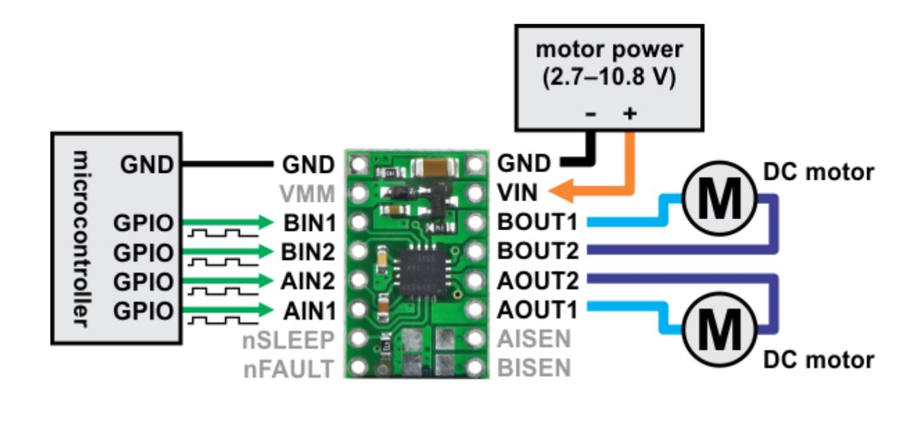
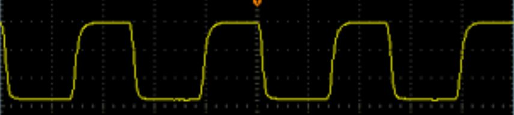
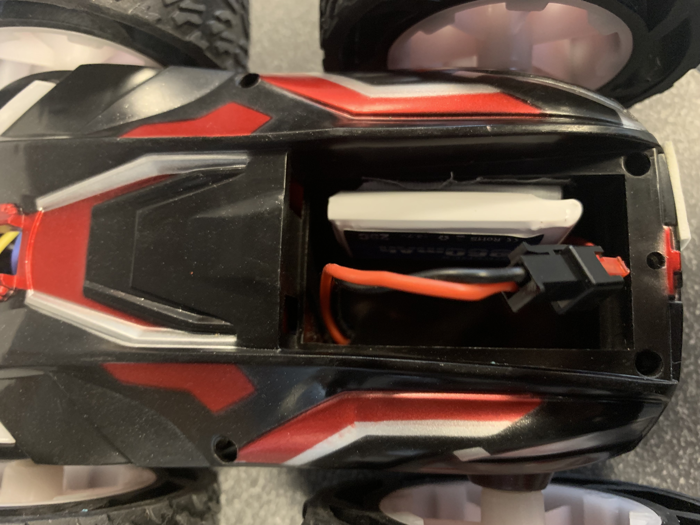
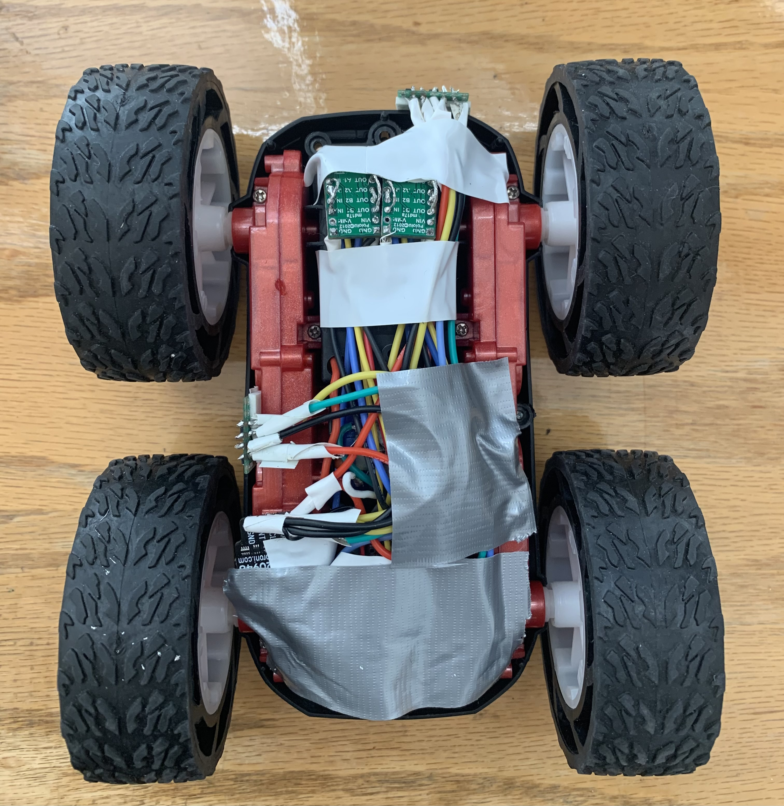

# Author: Swapnil Barot (NetID: spb228)
---

[Return to Main Page](https://spbarot.github.io/)

## I. Objective

The primary objective of this lab is to change the controls of the robot from a manual scheme to an open loop scheme [1]. The off-the-shelf robot’s electronics shall be gutted and replaced by the laboratory equipment. The secondary goal of the lab is to interface the two dual motor drivers and integrate them with the Artemis. All electronics shall be securely mounted to the robot chassis upon the completion of this lab. The robot should be able to execute a programmed series of movies with the help of the two dual motor drivers. 

---

## II. Materials/Software

1. 1x SparkFun RedBoard Artemis Nano
2. 1x USB A to C Cable
3. 1x R/C Stunt Car
4. 2x Dual Motor Driver
5. 2x Li-ion 3.7V 400mAh (or more) Battery

---

## III. Procedure/Design/Results
#### Prelab 

The diagram below represents the circuit interconnections with respect to the two dual motor drivers and the Artemis board. Any analog to digital pin on the Artemis can be utilized as inputs to the motor drivers. Artemis pins A0 and A1 are used to control the first motor driver and pins A14 and A15 are used to control the second motor driver. 



---

#### Task 1 – One Motor Driver 

The necessary power and signal outputs are connected to the motor driver. The motor driver input wires, output wires, ground wires, and Voltage-In wire are soldered. A power supply is utilized to input a 3.7 V signal to the motor driver (to mimic the 850mAh battery). Then, oscilloscope wiring was hooked up to the output pins of the motor driver. First oscilloscope wire was connected to one motor driver output while the other wire was connected to the other motor driver output. 

---

#### Task 2 – AnalogWrite Commands 

The following commands were added to the example analogWrite program to generate an output. The analog value of 127 is written to pin A0 while the value of 0 is written to pin A1. This signals the motor to provide a “forward motion” output. 

The oscilloscope reading represented a square wave with a duty cycle of 50%. The negative edge of the wave decays slightly instead of instantaneously falling to 0. This may be a result of the influence of the several electronic components on the Artemis and the motor driver.  The oscilloscope image below is an accurate replica of what the true oscilloscope reading represented in the lab. 

```
// left motor
// output of 127 implies a 50% duty cycle
  analogWrite(A0, 127);     // forward motion
  analogWrite(A1, 0);         // backward motion
```



---

#### Task 3 – Taking the Car Apart

The car is taken apart to remove the off-the-shelf electronics components to be replaced by the laboratory equipment. The on-board wiring is disconnected and removed from the robot. The 650mAh battery is connected and soldered to the motor driver. 

```
// left motor
// output of 127 implies a 50% duty cycle
  analogWrite(A0, 0);             // forward motion
  analogWrite(A1, 127);         // backward motion
```

---

#### Task 4 – One Set of Wheels

The car is then placed on one side and the program shown in Task 2 is flashed onto the Artemis. This enables the Artemis to send a PWM to the motor driver, making the wheels rotate in a “forward” motion. If the outputs of the two pins are reversed, the wheels will rotate in a “backward” motion. 

---

#### Task 5 – Using 850mAh Battery

The power supply input to the motor driver is disconnected. A 850mAh battery is used instead of the power supply. The function of one motor driver is again tested and verified with the new battery connection. 



---

#### Task 6 – Second Motor/Motor Driver

Tasks  3 – 5 are followed for the second motor driver. The following code is used to control the second motor. 

```
  // right motor
  analogWrite(A14, 127);      // forward motion
  analogWrite(A15, 0);          // backward motion
```

---

#### Task 7 – Install All Components on Car Chassis

Finally, all the electronic components are securely installed on the robot using two-sided tape, electrical tape, and duct tape. One TOF sensor is placed on the front of the car while the other is placed on the left side of the chassis, between two wheels. The IMU is placed on top of the chassis. The Artemis and the associated 650mAh battery are placed inside the compartment where the removed PCB was placed. The two motor drivers are located on the other side of the 850mAh battery compartment. 



---


#### Task 8 – Explore Lower Limit

To test the lower limit of the motor at which the robot can move, a trial and error method was used. First, the analog output of 30 (12% duty cycle) was tried which made the wheels turn, however, could not move the robot once placed on the ground. Then the analog output was gradually tested and increased until the robot was able to move. The lower limit of the motor at which the robot moves occurs at the PWM output of 42. This roughly results in a duty cycle of approximately 17%. 

<iframe width="560" height="315" src="https://www.youtube.com/embed/Ur40XzfMPZI" frameborder="0" allow="accelerometer; autoplay; encrypted-media; gyroscope; picture-in-picture" allowfullscreen></iframe>

---

#### Task 9 – Calibration Factor

While running the robot on the ground, it is evident that the motors do not spin at the same rate. The right motor seems to spin at a higher rate, making the robot turn rightwards instead of going straight. Therefore, a boost is provided to the left motor to spin at the same rate as the right motor. This boost can also be seen as a calibration factor provided to the left motor, to match the output of the right motor. 

Using a trial and error method, it is noticed that the left motor functions at about 92% of the rate when compared to the right motor. Therefore, the left motor’s analog value must be multiplied by (1/0.92) 1.08 to match the output of the right motor. Testing at an output of 60 (24% duty cycle) for the right motor, the left motor’s analog value (60) is multiplied by 1.08 to achieve the analog value of 65. This ensures that the true motor outputs match, resulting in a straight line path for the robot. 

 <iframe width="560" height="315" src="https://www.youtube.com/embed/6dM7TGw9aJM" frameborder="0" allow="accelerometer; autoplay; encrypted-media; gyroscope; picture-in-picture" allowfullscreen></iframe>

<br>

 <iframe width="560" height="315" src="https://www.youtube.com/embed/R1XxlmfvRHw" frameborder="0" allow="accelerometer; autoplay; encrypted-media; gyroscope; picture-in-picture" allowfullscreen></iframe>

---

#### Task 10 – Open Loop Control

The robot is programmed to demonstrate open lop control by cycling through the following movement loop: 
*  Go forward for 1 second
* Stop
* Turn right for 1 second
* Stop
* Go forward for 1 second
* Stop
* Turn right for 1 second
* Stop
* Go forward for 1 second

``` 
  // forward
  analogWrite(A0, 65);     // left motor, forward motion
  analogWrite(A14, 60);    // right motor, forward motion
  
  delay(1000);    // move forward for 3 seconds

  // stop
  analogWrite(A0, 0);       
  analogWrite(A14, 0);

  delay(2000);   

  // turn right 
  analogWrite(A0, 150);       
  analogWrite(A14, 30);

  delay (1000);              

  // stop
  analogWrite(A0, 0);       
  analogWrite(A14, 0);

  delay(2000);   

  // forward
  analogWrite(A0, 65);    
  analogWrite(A14, 60);    
  
  delay(1000);               

  // stop
  analogWrite(A0, 0);       
  analogWrite(A14, 0);

  delay(2000);   

  //turn right 
  
  analogWrite(A0, 150);       
  analogWrite(A14, 30);

  delay (1000);             

  // stop
  analogWrite(A0, 0);       
  analogWrite(A14, 0);

  delay(2000);   

  // forward
  analogWrite(A0, 65);     
  analogWrite(A14, 60);    
  
  delay(1000);
```


<iframe width="560" height="315" src="https://www.youtube.com/embed/erF1TMNzm_Y" frameborder="0" allow="accelerometer; autoplay; encrypted-media; gyroscope; picture-in-picture" allowfullscreen></iframe>


---


#### Task 11 – Additional Task: AnalogWrite Frequency

As per the Arduino – analogWrite webpage, the PWM frequency for the Nano board is 490 Hz [3]. The motor driver’s internal PWM frequency is 50 kHz, as seen on the motor driver cut sheet [2].  Manually configuring the timers to generate a faster PWM output will cause the motors to spin faster, increasing the speed of the robot. Increasing the PWM output will also provide greater control over the movements of the robot, and we will be able to send more signals in a time segment.
 
---

#### Task 12 – Additional Task: Ramp up and down

The program below ramps up and down in speed gradually. The distance values from the front TOF sensor are reported over Bluetooth to the computer. The distance information, with the help of the timing data, can help extrapolate the speed values of the robot.

---


## IV. Conclusion

The objective of this lab, to demonstrate an open loop control scheme was successfully satisfied. The knowledge gained from this lab in regards to programming the Artemis and interfacing with the dual motor drivers will be very useful in future labs. One issue encountered during the lab was the short battery life of the 850mAh battery (~ 9 minutes). In the future, it will be helpful to keep more batteries in the kit. Overall, the lab was quite smooth and the lab guideline seemed to very helpful. 

---

## V. References

1. [ECE 5960 – Lab 5 Guideline](https://cei-lab.github.io/ECE4960-2022/Lab5.html)
2. [Motor Driver Data sheet](https://www.ti.com/lit/ds/symlink/drv8833.pdf?HQS=dis-dk-null-digikeymode-dsf-pf-null-wwe&ts=1646842101533&ref_url=https%253A%252F%252Fcei-lab.github.io%252F)
3. [Arduino analogWrite Command](https://www.arduino.cc/reference/en/language/functions/analog-io/analogwrite/)

---

[Return to Main Page](https://spbarot.github.io/)


