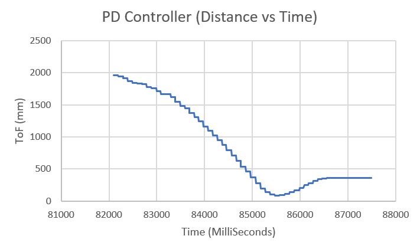
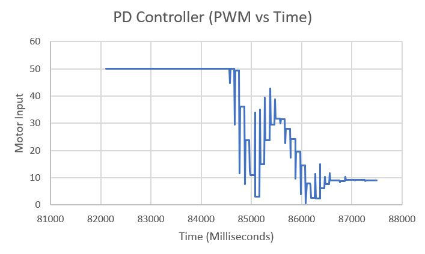

# Author: Swapnil Barot (NetID: spb228)
---

[Return to Main Page](https://spbarot.github.io/)

## I. Objective

The primary objective of this lab is to implement a Closed-Loop Control (PID) system to control the robot positioning with respect to obstacles. Task A – “Don’t Hit the Wall” is selected, which revolves around driving as fast as possible towards a wall, then stopping at exactly 300mm away with the help of ToF sensor readings and the PID controller.

---

## II. Materials/Software

1. 1x SparkFun RedBoard Artemis Nano
2. 1x USB A to C Cable
3. 1x R/C Stunt Car
4. 2x Dual Motor Driver
5. 2x Li-ion 3.7V 650mAh (or more) Battery
6. 2x 4m ToF Sensor
7. 9DOF IMU Sensor
9. 1x Qwiic Connector
10. Measuring Tape

---

## III. Procedure/Design/Results
#### Prelab 

The following tasks shall be accomplished as a part of this lab: 
* Implement a PID/PD controller 
* Setup the BLE framework to send data
* Setup the Jupyter framework to receive data 
* Integrate PID program with BLE program
* Process, condition, and plot the data in Jupyter

To send and receive data, the BLE and Jupyter framework are first setup. The EString class is utilized to capture and transmit the ToF sensor readings, time stamps, and motor inputs onto Jupyter. Below is an example of the logic. 

```
dist_array[counter] = distance;
time_array[counter] = time_current;
pwm_array[counter] = internalSpeed;
for (int i = 0; i < counter; i++){
      tx_estring_value.clear();
      tx_estring_value.append(dist_array[i]);
      tx_estring_value.append("|");
      tx_estring_value.append(time_array[i]);
      tx_estring_value.append("|");
      tx_estring_value.append(pwm_array[i]);
      tx_characteristic_string.writeValue(tx_estring_value.c_str());
   }
```

For the above code to work, several issues may need to be debugged. For example, buffer overflow is an issue that came up which was solved by limiting the size of the arrays or stopping the program after a certain number of seconds. Another issue that came up was a “hard-fault” error which was caused by storing a float value into a static long value. This was resolved by matching the formats of both values (float values). 

The Jupyter file was setup to receive the data under a notification handler. A CMD command (START_REC) is used to trigger the PID and data recording on the Artemis. Another CMD command (SEND_DATA) is used to stop the PID and data recording and start transmitting the information to Jupyter. The following code is used to represent the described logic. 

```
def notification_handler(uuid, value):
    global distance
    distance=ble.bytearray_to_string(value) 
    print(distance)
ble.start_notify(ble.uuid['RX_STRING'], notification_handler)
ble.send_command(CMD.START_REC, "")
ble.send_command(CMD.SEND_DATA, "")

```

---

#### PID/PD Controller 

A PID controller is a very well-known closed loop control system used for numerous applications. The control scheme operates by providing the required output to a meet a specified setpoint. Sensors are often used to determine the error in the controller so that the feedback can be adjusted accordingly to meet the setpoint. For this lab, a PD controller is utilized which outputs the PWM duty cycle that is used to drive the motors.  Upon trial and error, it was noticed that the controller is the most effective when the KP value is 0.15, and the KD value is 3.0. The KD value is extremely high as it was not deemed effective for lower values. The integrator was not used as it delivered an overshoot. The following code is used to compute the PID output. It shall be noted that the PID controller is made from scratch. 
```
float PID_pass(float time_current, float time_previous, float error_previous, float current_error, float I_sum) 
{
return (P*current_error) + (I*I_sum) + ((D*(current_error - error_previous))/(time_current -   time_previous));
}
```

---

#### Task A – Don’t Hit the Wall! 

Task A involves driving as fast as possible towards a wall, then stopping at exactly 300mm away with the help of ToF sensor readings and the PID controller. Several considerations are explored to come up with a control scheme. 
The following videos represent different test runs with different PID parameter settings. The first video has a KP value of 0.1 and a KD value of 0.2. The second video has a KP value of 0.2 and a KD value of 5.0. The third video has a KP value of 0.15 and a KD value of 3.0. The third video represents the most effective implementation of the controller. 

<iframe width="560" height="315" src="https://www.youtube.com/embed/m5zGb7jiC9o" frameborder="0" allow="accelerometer; autoplay; encrypted-media; gyroscope; picture-in-picture" allowfullscreen></iframe>

<iframe width="560" height="315" src="https://www.youtube.com/embed/QXOUww6Jfe0" frameborder="0" allow="accelerometer; autoplay; encrypted-media; gyroscope; picture-in-picture" allowfullscreen></iframe>

<iframe width="560" height="315" src="https://www.youtube.com/embed/8CnVVk1bOHc" frameborder="0" allow="accelerometer; autoplay; encrypted-media; gyroscope; picture-in-picture" allowfullscreen></iframe>

Below are the Distance VS Time and Motor Input VS Time graphs for Test Run 3 (video 3). 





The fastest speed achieved during the demos was approximately 0.75 meters/second. It is believed that the speed can be a lot faster however, the program is running with low to medium PWM values and the space in my apartment is slightly limited. 

---

#### Proportional Controller Range Reasonable Range

Proportional controller’s theoretical range can be determined by calculating the upper and low bounds of the constant KP. The lower bound can be determined by dividing the highest possible PWM output, by the sensor’s range (90/3500mm). This results in the minimum KP value of 0.026. The upper bound can be determined by dividing the lowest possible PWM output, by the acceptable distance error (10/20mm). This results in the maximum KP value of 0.5. However, using 0.5 for KP results in a major overshoot. It was noted that 0.15 is the ideal KP value for this controller.  

---

#### ToF Sensor Range

The ToF sensor’s range and sampling time play a major role in the quality of the PID control that can be achieved in this lab. ToF sensor’s long range mode is utilized in the lab so that ranges can be determined from much longer distance. This can be vital as the PID controller can start controlling the robot’s deceleration from a much farther distance (in long range mode), making the control scheme more effective. 

---

#### Derivative Controller Kick
The derivative-aspect of the utilized PD controller results in a “derivative kick” which is a phenomenon in which the value of the error changes suddenly whenever the set point is adjusted. This sudden jump in the error causes the derivative to be very large which may cause the controller to saturate. To combat this issue, a low pass filter can be used to decrease the noise in the derivative error and smooth out the control signal. Had there been more time, a low pass filter would have been implemented for this lab. 

---

#### Integral Wind Up

Integral wind up is a phenomenon where a large change in setpoint causes the integral term to accumulate a large error during the rise. This causes the controller to overshoot and oscillate until the error is unwound. While an integral controller is not used, a plausible solution is to zero out the integral value every time the error crosses zero. 

---

## IV. Conclusion

The objective of this lab, to demonstrate a closed loop control scheme was successfully satisfied. This lab was extremely challenging yet very rewarding. There were several issues faced during the lab such as hardware faults, software bugs (BLE). Overcoming these challenges was very satisfying and helpful as the experimenter understood the causes of these issues. The knowledge gained from this lab in regards to programming the Artemis (C++), interfacing with the motor drivers and sensors, implementing PID control, and jupyter (python) will be very useful in the future labs. The staff was also extremely helpful during the lab. 

---

## V. References

1. [ECE 5960 – Lab 6 Guideline](https://cei-lab.github.io/ECE4960-2022/Lab6.html)
2. [ECE 5960 – Lab 2 Guideline](https://cei-lab.github.io/ECE4960-2022/Lab2.html)
3. [ECE 5960 – Lecture 7](https://cei-lab.github.io/ECE4960-2022/lectures/FastRobots-7-PID.pdf)
4. [ECE 5960 – Lecture 8]( https://cei-lab.github.io/ECE4960-2022/lectures/FastRobots-8-PID_continued.pdf)
5. [PID Theory Explained – NI](https://www.ni.com/en-us/innovations/white-papers/06/pid-theory-explained.html)

---

[Return to Main Page](https://spbarot.github.io/)


