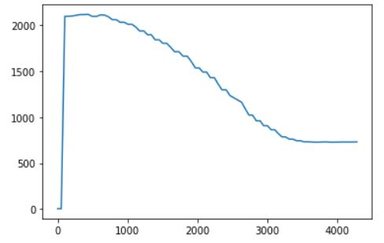
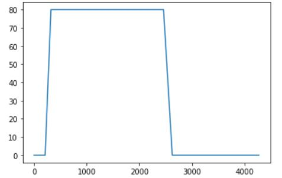
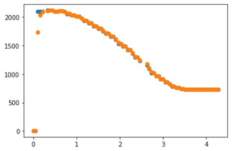
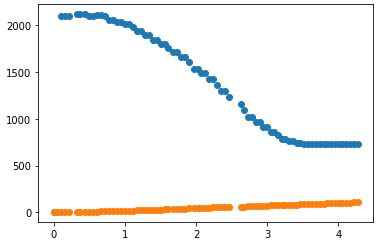
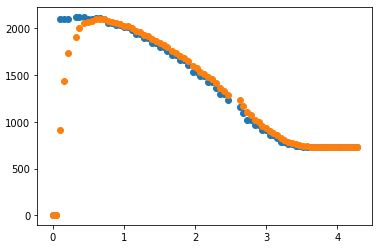
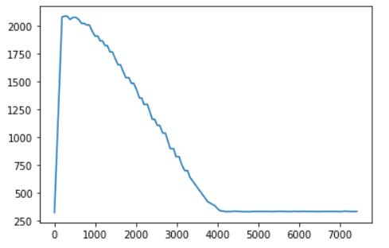
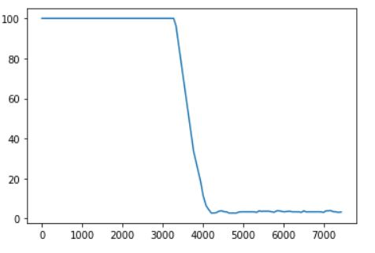

# Author: Swapnil Barot (NetID: spb228)
---

[Return to Main Page](https://spbarot.github.io/)

## I. Objective

The primary objective Lab 7 is to implement a Kalman Filter with the PID scheme designed in Lab 6. The purpose of employing a Kalman Filter is to accomplish the behavior displayed in Lab 6 at a faster pace. This speed up will assist in completing stunts in the next lab (Lab 8). 

---

## II. Materials/Software

1. 1x SparkFun RedBoard Artemis Nano
2. 1x USB A to C Cable
3. 1x Fully Assembled Robot (Artemis, Batteries, TOF Sensors, IMU)
4. Measuring Tape
5. Obstacle for the Robot (Wall)

---

## III. Procedure/Design/Results
#### Prelab 

Lectures 11 and 12 - Implementing a Kalman Filter (see references for links) are reviewed prior to initiating the lab work. 

---

#### 1. Step Response

A step response is executed by driving the car towards a wall while logging motor input values and ToF sensor ouput. The chosen PWM value (80) matches what I used in Lab 6. The program is set up so that the PWM value is clipped at 80. To implement a step response, I sent a ping from Jupyter which would trigger the step response in Arduino. I used a counter to provide the PWM step to the motors (if counter is between 50 and 300, PWM value is 80). Below are the distance vs time and PWM vs time graphs of the step response. 




The measured steady state speed is calculated to be 510 mm/s and the 90% rise time is around 2.0 seconds. The A and B matrices are calculated in the following steps. 

---

#### 2. Kalman Filter Setup

The d and m matrices are calculated as per the code snippet below. 
```
velocity  = 510 mm/s
rise time = 2.0 s
d = 1/velocity
d = 1/510 
m = -d*(rise time)/ln(0.1) = 0.0017
-d/m = -1.15
1/m = 588
delta_t = 1 / sampling_rate
sampling_rate = 79
delta_t = 0.0127
```
Based on the calculated d, m, and delta_t values above, the A and B matrcies are calculated as per below. 
```
A = np.array([[0, 1], [0, -1.15]])
B = np.array([[0], [588]])
C = np.array([[-1, 0]])
Delta_T = 0.0127
A_d = np.identity(2) + Delta_T * A
B_d = Delta_T * B
A_d = [[1.       0.0127  ]
[0.       0.985395]]

B_d = [[0.    ]
[7.4676]]

```

---

#### 3. Sanity Check - Kalman Filter

Once the A, B, and C matrices are identified, the Kalman filter algorithm is implemented on Jupyter (Python) to sanity check the calculations. 

```
def kf(mu,sigma,u,y):
    mu_p = A_d.dot(mu) + B_d.dot(u) 
    sigma_p = A_d.dot(sigma.dot(A_d.transpose())) + sig_u
    sigma_m = C.dot(sigma_p.dot(C.transpose())) + sig_z
    kkf_gain = sigma_p.dot(C.transpose().dot(np.linalg.inv(sigma_m)))
    y_m = y-C.dot(mu_p)
    mu = mu_p + kkf_gain.dot(y_m)    
    sigma=(np.eye(2)-kkf_gain.dot(C)).dot(sigma_p)

    return mu,sigma
```

Several values for sigma_1, sigma_2, and sigma_3 were tried to analyze the different results. Higher values for sigma_1 and sigma_2 implies that the model is uncertain and that the sensor values are followed. Higher sigma_3 values imply that there is a lot of sensor noise so more confidence is put into the model. 

Sigma_1 = 50, Sigma_2 = 50, Sigma_2 = 5
<br>


Sigma_1 = 5, Sigma_2 = 5, Sigma_2 = 50
<br>


Sigma_1 = 15, Sigma_2 = 15, Sigma_2 = 5
<br>


---


#### 4. Kalman Filter Implementation on the Robot

Upon the verification of the Kalman Filter on Jupyter, the filter is implemented onto the robot. The same P,D, and setpoint values from Lab 6 are used for this implementation. Below is the code snippet of the implementation in Arduino. 

```
Matrix<1,2> C_mat = { -1, 0 };

Matrix<2,2> sig_u = { 15^2, 0,
                      0, 15^2 };
Matrix<1,1> sig_z = { 5^2 };

// Discretize A & B
float delta_t = 0.130;
Matrix<2,2> I_mat = { 1, 0,
                      0, 1};
Matrix<2,2> A_d   = { 1, 0.0127,
                      0, 0.985 };
Matrix<2,1> B_d   = { 0,
                      7.47};

Matrix<2,2> sig   = { 10^2, 0,
                      0, 10^2 }; 
Matrix<2,1> x_val = {-2000,
0	}; 
void kf_func(float sensor_reading, float pwm_val){
  Matrix<2,1> x_p = A_d*x_val + B_d*pwm_val;
  Matrix<2,2> sig_p = A_d*sig*(~A_d) + sig_u;

  Matrix<1,1> y_curr = { sensor_reading };
  Matrix<1,1> y_m = y_curr - C_mat*x_p;
  Matrix<1,1> sig_m = C_mat*sig_p*(~C_mat) + sig_z;

  Matrix<1,1> sig_m_inv = sig_m;
  Invert(sig_m_inv);

  Matrix<2,1> kf_gain = sig_p*(~C_mat)*(sig_m_inv);

  // Update
  x_val = x_p + kf_gain*y_m;
  sig = (I_mat - kf_gain*C_mat)*sig_p;
}
void kf_pid(){
    distanceSensor.startRanging();
    float distance = distanceSensor.getDistance();
    distanceSensor.clearInterrupt();
    distanceSensor.stopRanging();
    currentMillis = millis();
    timerCountCurrent = millis();
    kf_func(distance, pwm_val);
    setSpeed_val(PID_pass(currentMillis, previousMillis, error_previous, ((x_val(0,0)*-1) - setPoint)));
    error_previous = (x_val(0,0)*-1) - setPoint;
    if (timerCountCurrent - timerCountPrevious > interval){
      if (counter_h < 1000 ){
        tof_values[counter_h] = distance; //Get the result of the measurement from the sensor
        
        timeValues[counter_h] = currentMillis;
        pid_out[counter_h] = setSpeed_val(PID_pass(currentMillis, previousMillis, error_previous, ((x_val(0,0)*-1) - setPoint)));;//speed_val;
      }else if (counter_h == 1000){
         Serial.println("400 reached");
      }
      counter_h += 1;
      timerCountPrevious = timerCountCurrent;
    }
    previousMillis = currentMillis;
}
```

Below are the distance vs time and PWM vs time graphs as well as the video of the Kalman Filter implemented PID control. The motion is a lot smoother and faster due to the Kalman Filter and the robot is extremely close to the setpoint of 300 mm.




<iframe width="560" height="315" src="https://www.youtube.com/embed/IdLj2RFyy4Y" frameborder="0" allow="accelerometer; autoplay; encrypted-media; gyroscope; picture-in-picture" allowfullscreen></iframe>


---


## IV. Conclusion
The objective of this lab, to implement a Kalman Filter on the robot was successfully satisfied. There were several issues faced during the lab such as hardware faults, software bugs (BLE and hardfaults). Overcoming these challenges was very satisfying and the knowledge gained from this lab in regards to implementing the Kalman Filter will be very useful in the future labs. The Lab 7 guideline as well as the staff was also extremely helpful during the lab. 

---

## V. References

1. [ECE 5960 – Lab 7 Guideline](https://cei-lab.github.io/ECE4960-2022/Lab7.html)
2. [ECE 5960 – Lecture 11](https://cei-lab.github.io/ECE4960-2022/lectures/FastRobots-11-LQR-KF.pdf)
3. [ECE 5960 – Lecture 12](https://cei-lab.github.io/ECE4960-2022/lectures/FastRobots-12-KF-Navigation.pdf)

---

[Return to Main Page](https://spbarot.github.io/)
