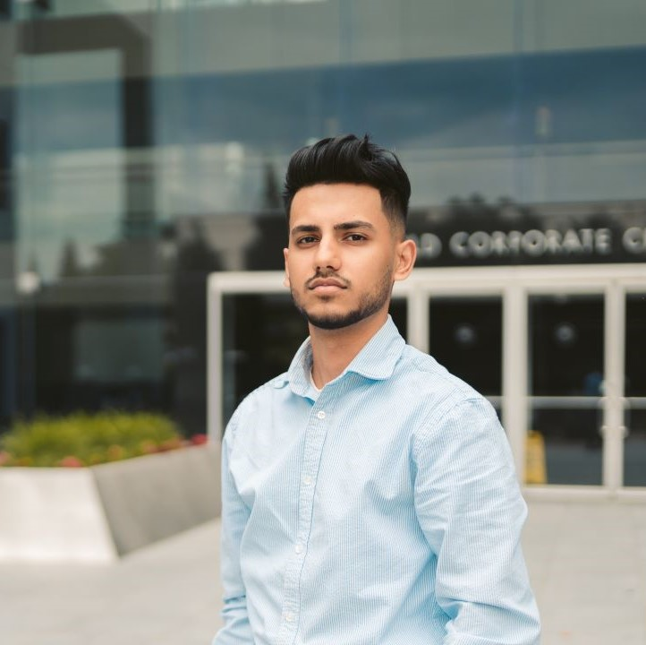

# Author: Swapnil Barot (NetID: spb228)
---

## About Me
I am a current Master of Engineering student at Cornell University majoring in Electrical and Computer Engineeering. I received my Bachelor of Science in Electrical and Computer Engineering from New York Institute of Technology. My area of interests include embedded systems, microcontrollers, hardware, and power systems. I can be reached at spb228@cornell.edu.

## Course Description:
ECE 5960 - Design and Implementation of Fast Robots focuses on systems level design and implementation of dynamic autonomous robots. The course revolves around designing and building a fast autonomous car, while exploring reactive control on an embedded processor, sensors, dynamic behaviors, and acting forces. The topics covered include embedded systems design using C++ and Python, robot controls, sensors (passive/active), signal processing and filtering, communication (bluetooth, i2C, serial), and planning and search algorithms. 

## Labs:
[Lab 1 - Artemis](./Labs/Lab 1 - Artemis.md)  
[Lab 2 - Bluetooth](./Labs/Lab 2 - Bluetooth.md)  
[Lab 3 - Sensors](./Labs/Lab 3 - Sensors.md)  
[Lab 4 - Characterize Your Car](./Labs/Lab 4 - Characterize Your Car.md)  
[Lab 5 - Open Loop Control](./Labs/Lab 5 - Open Loop Control.md)  
[Lab 6 - Closed Loop Control](./Labs/Lab 6 - Closed Loop Control.md)  
[Lab 7 - Kalman Filters](./Labs/Lab 7 - Kalman Filters.md)  
[Lab 8 - Stunts](./Labs/Lab 8 - Stunts.md)  
[Lab 9 - Mapping](./Labs/Lab 9 - Mapping.md)  
[Lab 10 - Simulator](./Labs/Lab 10 - Simulator.md)  
[Lab 11 - Grid Localization Using Bayes Filter](./Labs/Lab 11 - Grid Localization Using Bayes Filter)  
[Lab 12 - Localization (Real)](./Labs/Lab 12 - Localization.md)  
[Lab 13 - Path Planning and Execution](./Labs/Lab 13 - Path Planning and Execution.md)  
