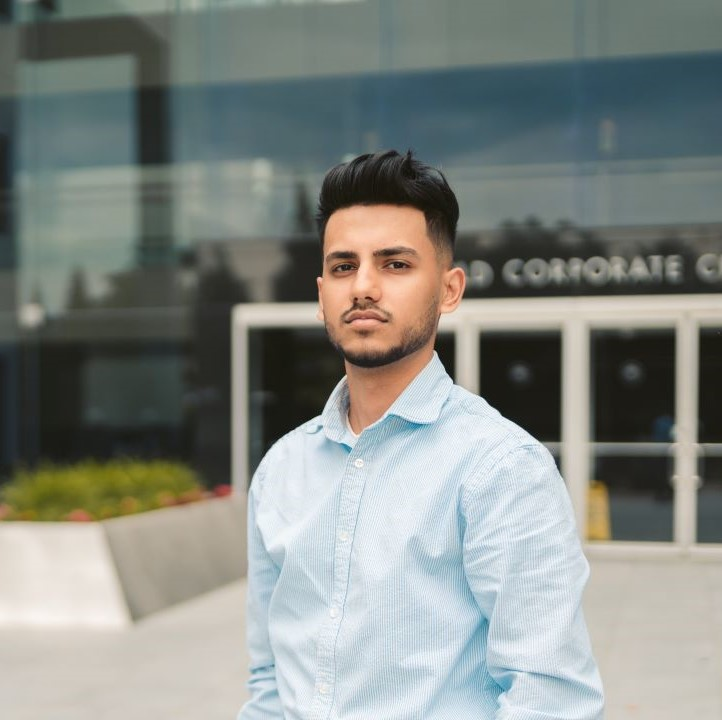

# About Me
My name is Jason Russo, a current M.Eng student in ECE at Cornell University. This semester, I will be building a robot as a part of ECE 4960: Fast Robots. Check back at this site for updates on my project!

## Course Description:

## Labs:
[Lab 1 - Artemis](./labs/lab1.md)  

